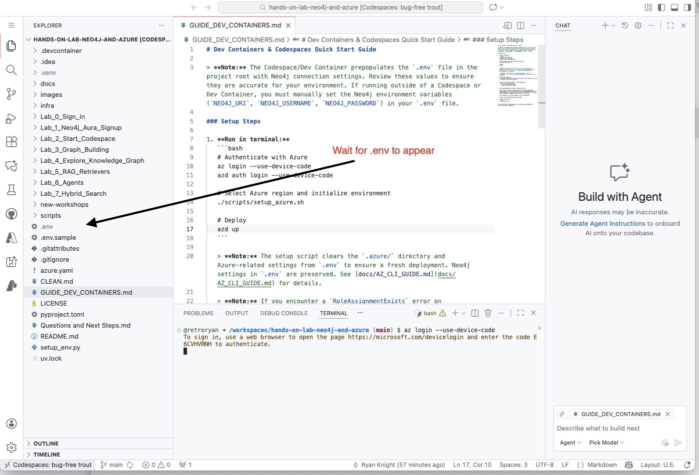

# Dev Containers & Codespaces Quick Start Guide

> If you are running locally instead of using a Codespace, see [Quick Start: Open in a Local Dev Container](#quick-start-open-in-a-local-dev-container) below.

## Quick Start: GitHub Codespaces

> **Warning:** It may take several minutes for the Codespace to start. After it starts, please wait an additional couple of minutes for all post-install scripts to finish running.  You can tell when it is finished initalizing because the .env will be created in the root directory.
>
> 

> **Note:** The Codespace/Dev Container prepopulates the `.env` file in the project root with Neo4j connection settings. Review these values to ensure they are accurate for your environment. If running outside of a Codespace or Dev Container, you must manually set the Neo4j environment variables (`NEO4J_URI`, `NEO4J_USERNAME`, `NEO4J_PASSWORD`) in your `.env` file.

### Setup Steps

1. **Authenticate with Azure:**
   ```bash
   az login --use-device-code
   ```

2. **Get your Foundry project endpoint:**

   You will use the Foundry project you created in Lab 3. To find the project endpoint:
   - Go to https://ai.azure.com/
   - Open your project (the one you created in Lab 3)
   - On the project **Overview** page, find the **Libraries** section and look under **Foundry**
   - Copy the **Project endpoint** — it looks like: `https://<resource-name>.services.ai.azure.com/api/projects/<project-name>`

3. **Configure environment variables:**

   Edit the `.env` file in the project root and add the following Azure variables (your Neo4j credentials should already be populated):

   ```
   AZURE_AI_PROJECT_ENDPOINT=<paste your project endpoint here>
   AZURE_AI_MODEL_NAME=gpt-4o-mini
   AZURE_AI_EMBEDDING_NAME=text-embedding-3-small
   ```

   > **Note:** Set `AZURE_AI_MODEL_NAME` to whichever model you deployed in Lab 3 (`gpt-4o-mini` or `gpt-4o`).

4. Move on to Lab 5 - Foundry Agents: [Lab_5_Foundry_Agents/README.md](Lab_5_Foundry_Agents/README.md)

---

## Quick Start: Open in a Local Dev Container

If you have Docker and VS Code installed locally, you can run the workshop in an isolated container volume without using a Codespace:

1. Install [Docker](https://www.docker.com/get-started/) and ensure it is running
2. Install [VS Code](https://code.visualstudio.com/) and the [Dev Containers extension](https://marketplace.visualstudio.com/items?itemName=ms-vscode-remote.remote-containers)
3. Open VS Code and run **Dev Containers: Clone Repository in Container Volume...** from the Command Palette (`F1`)
4. Enter `neo4j-partners/neo4j-and-azure-lab` and press Enter
5. VS Code will reload, clone the repo, and build the dev container — this may take several minutes
6. Once the build completes, continue with the [Setup Steps](#setup-steps) above

For more details, see the [VS Code Dev Containers documentation](https://code.visualstudio.com/docs/devcontainers/containers#_quick-start-open-a-git-repository-or-github-pr-in-an-isolated-container-volume).
