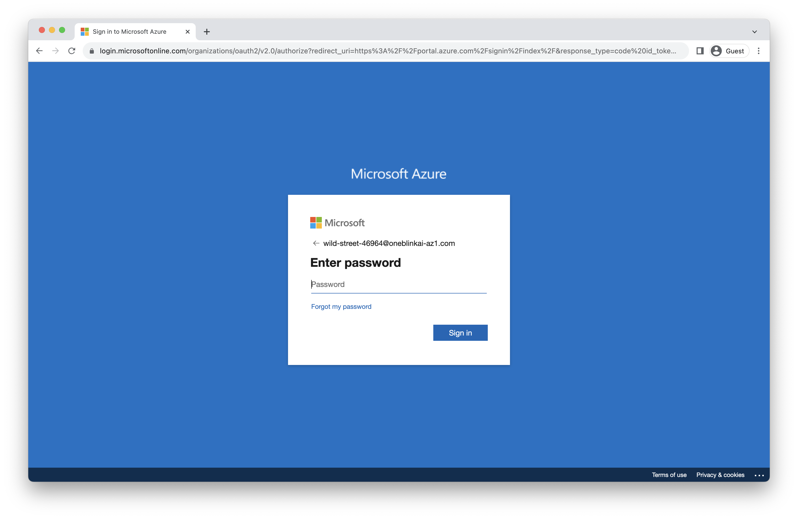
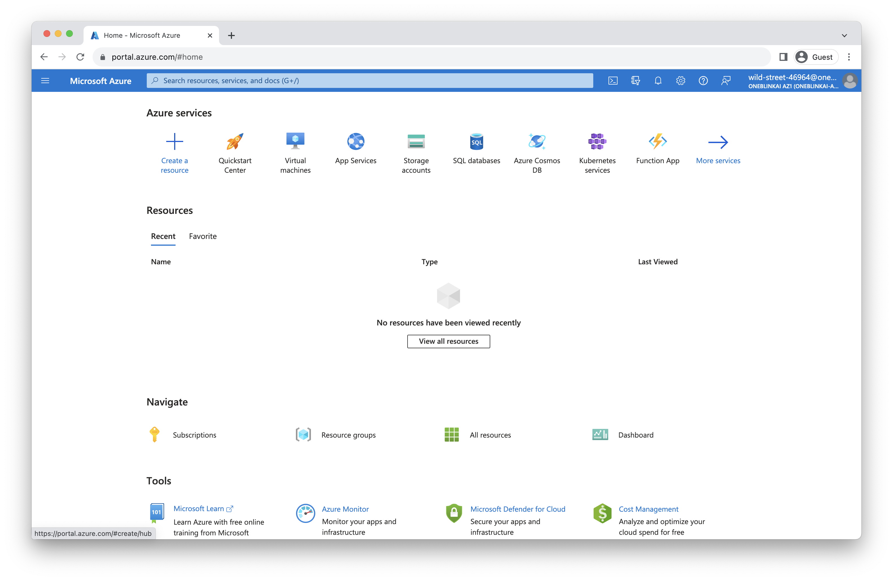

# Lab 0 - Sign In
At the start of this lab you should have been handed credentials for Azure.  In this first section, we're going to use those to sign in.

## Improving the Labs
As you work through these labs, we'd really appreciate your feedback.  One way to help us improve is to open an issue by going [here](https://github.com/neo4j-partners/hands-on-lab-neo4j-and-azure/issues).  Outright bugs, usability suggestions, and general comments are all appreciated.  Pull requests are great too!

## Sign into Azure
We're going to sign into a new Azure account.  You may already have other Azure accounts.  If you use Chrome, you might consider using a guest profile for these exercises.  That's not mandatory though and other browsers work fine too.
Our next step is to open the Azure portal [here](https://portal.azure.com/). 

Enter the email address you were given for this lab and click "Next."

Now enter the password you were given and click "Sign in."

Check the box for "Don't show this again" and click yes to continue sign in.

We're now authenticated and logged into the Azure portal.  Click "Maybe later" to dismiss the tour.

In the next lab we'll deploy Neo4j.
