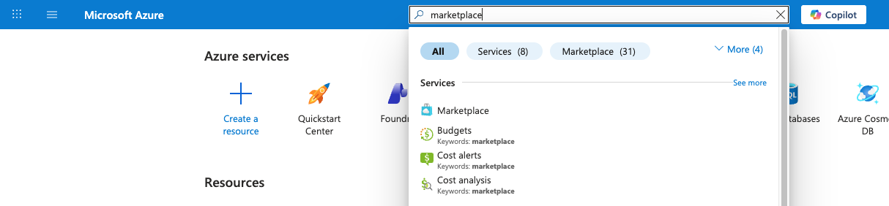
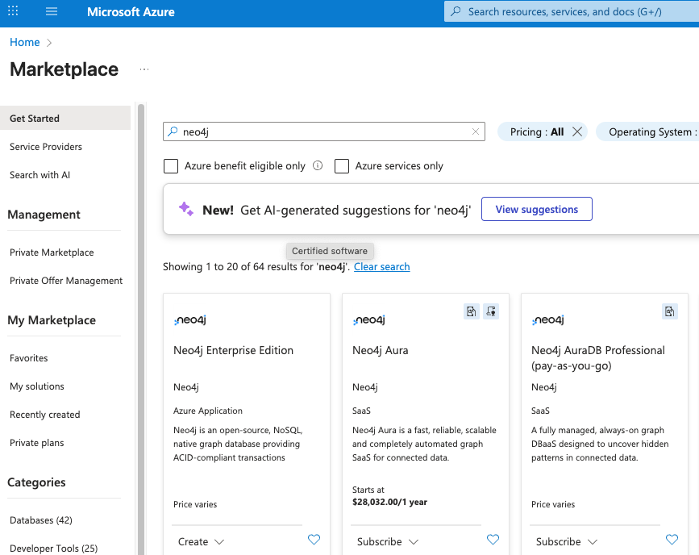
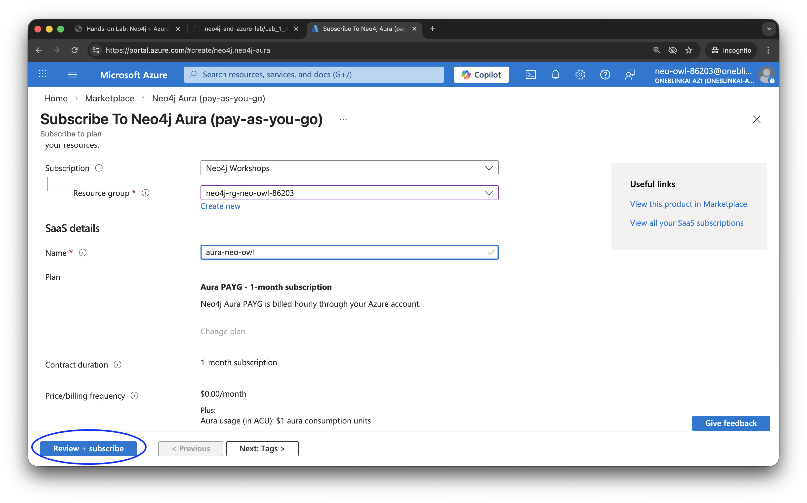
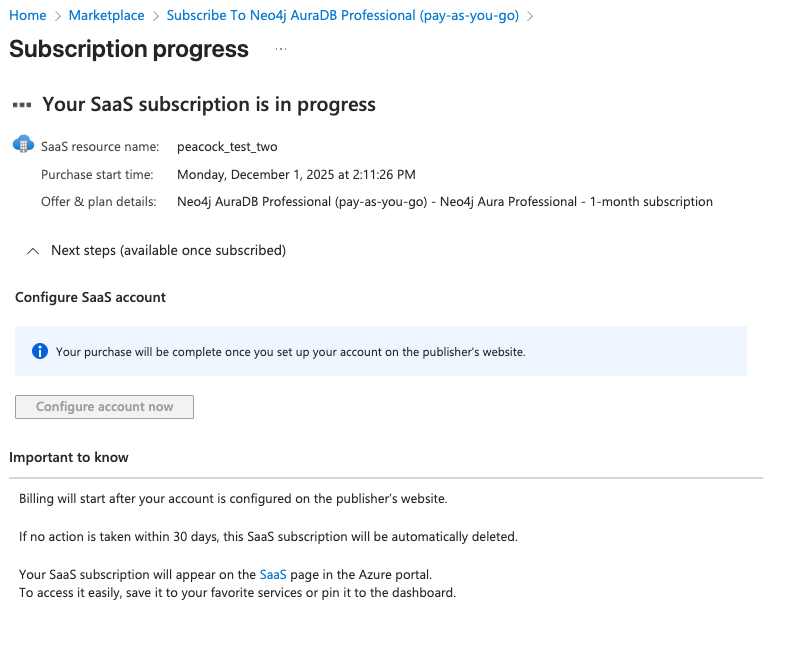
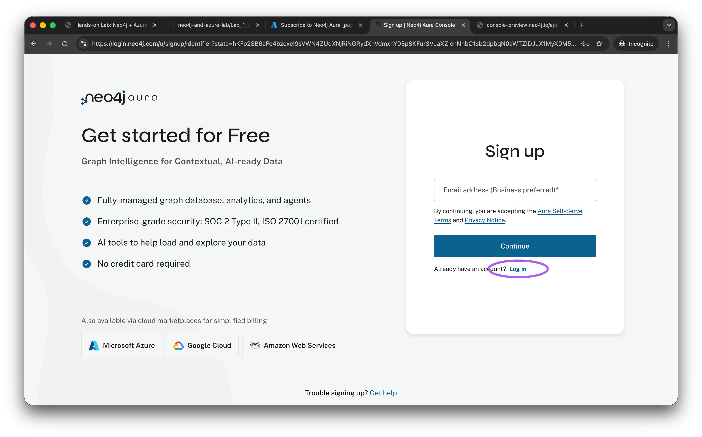
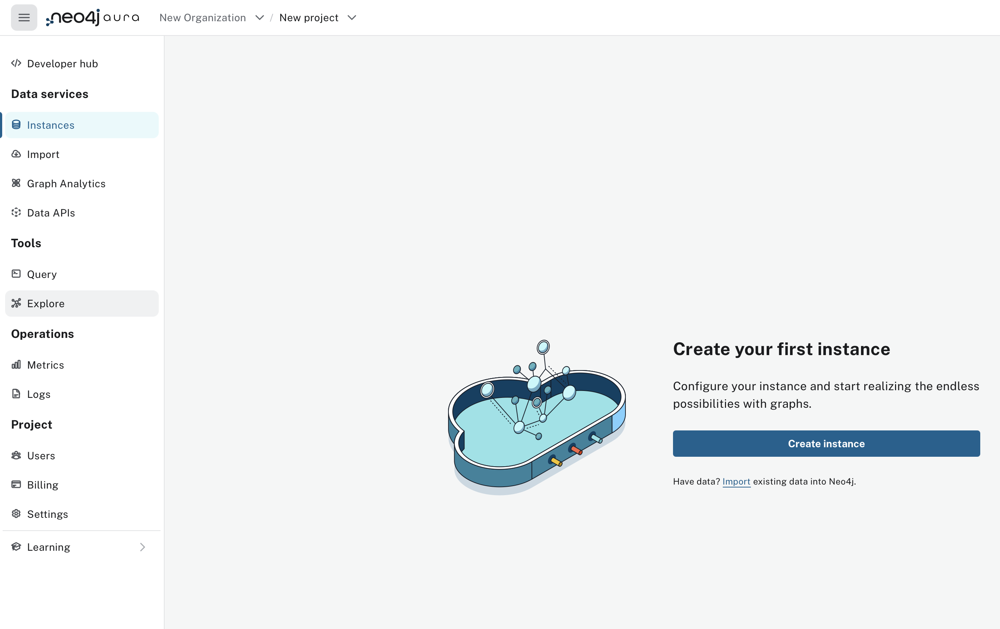
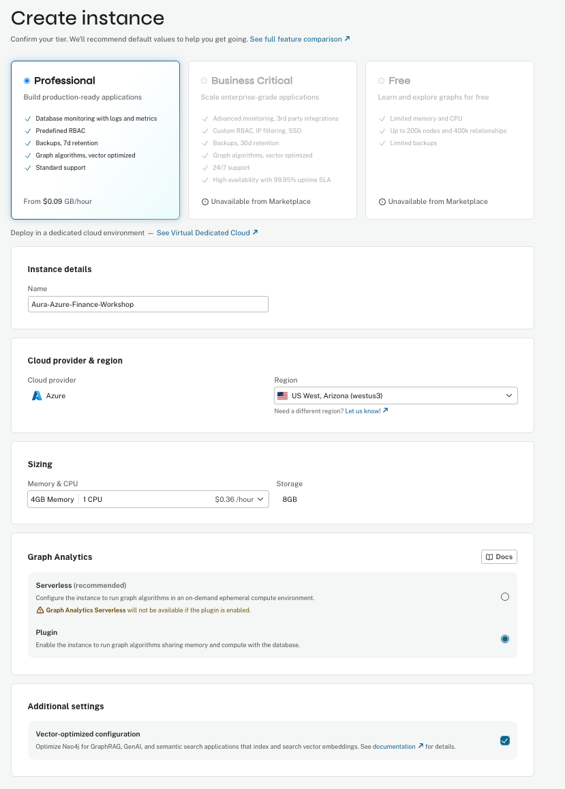
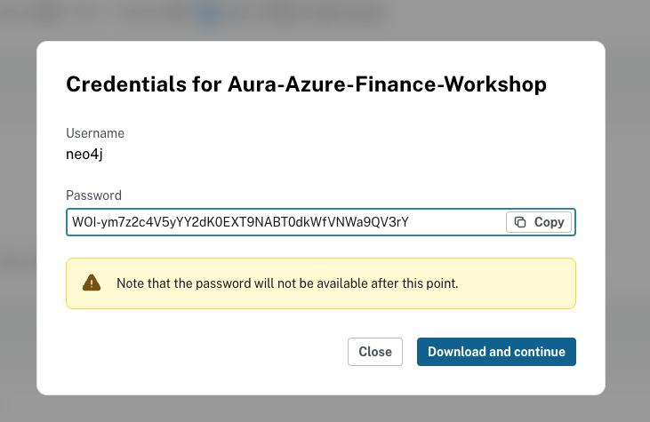

# Get Started with Neo4j Aura on Azure Marketplace

Follow these steps to subscribe to Neo4j Aura through the Azure Marketplace and create your first instance.

**Important:** Be sure to create your Aura instance in **US West** as shown in the configuration steps below.

## Step 1: Access the Azure Marketplace

Log in to the Azure Portal at [portal.azure.com](https://portal.azure.com). In the search bar at the top, type "marketplace" and select **Marketplace** from the results.

## Step 2: Find Neo4j Aura Pay-as-You-Go

In the Marketplace, search for "neo4j". From the results, locate and select **Neo4j AuraDB Professional (pay-as-you-go)**.

## Step 3: Subscribe to Neo4j AuraDB Professional

Click **Subscribe** on the "Aura PAYG" listing. Fill out the subscription form:

- **Subscription**: Select "Neo4j Workshops" 
- **Resource group**: Select the resource group from the previous lab (it will match your username)
- **Name**: Enter a memorable name for your SaaS resource
- **Plan**: Aura PAYG - 1-month subscription

Once you've filled these in, click "Review + subscribe" in the lower left corner.

## Step 4: Configure Your Account

After the subscription is created, click **Configure account now** to set up your Neo4j Aura account.

## Step 5: Create Your Neo4j Aura Account

You will be redirected to the Neo4j Aura login page. **Important: Do NOT use the "Continue with Microsoft" option!**

Instead, click **Sign up** and create a new account using your work email address. This ensures proper account linking with the Azure Marketplace subscription.

**NOTE: If you already have a Neo4j Aura account on your work email address, then select the "Log in" link below instead and log in using your normal procedure.**

## Step 6: Select New Project

Once logged into Neo4j Aura, click on New Project.

## Step 7: Create an Instance

In the Aura console, navigate to **Instances** in the left sidebar. Click the **Create instance** button to start configuring your Neo4j database.

## Step 8: Configure Your Professional Instance

Important! Please select Professional Instance

Configure your Neo4j Aura instance with the following settings:

- **Tier**: Professional
- **Instance name**: Choose a descriptive name (e.g., "Aura-Azure-Finance-Workshop")
- **Cloud provider**: Azure
- **Region**: **US West, Arizona** (required for this workshop)
- **Memory & CPU**: Select **4GB Memory | 1 CPU**
- **Graph Analytics**: Select **Plugin** (enables graph algorithms sharing memory with the database)
- **Additional settings**: Check **Vector-optimized configuration** for GraphRAG and semantic search applications

Click **Create** to provision your instance.

**Important: Save Your Credentials!**

After clicking Create, a credentials dialog will appear containing your connection URI, username, and password. **Save this information immediately** - the password will not be available after you close this dialog. Click **Download and continue** to save the credentials file. You will need these credentials in later labs.

Your Neo4j Aura database is now ready to use!
