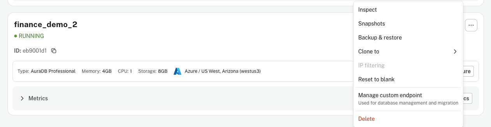
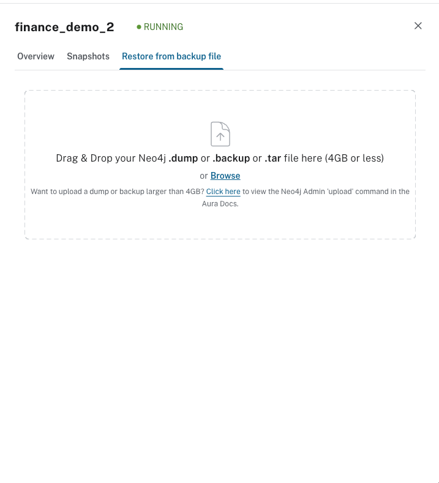

# Lab 1: Neo4j Aura Setup and Exploration

In this lab, you will set up your Neo4j Aura database on Azure Marketplace, restore the knowledge graph from a backup, and explore your graph visually.

## Prerequisites

- Completed **Lab 0** (Azure sign-in)
- Access to Azure Portal

## Part 1: Neo4j Aura Signup

Follow the instructions in [Neo4j_Aura_Signup.md](Neo4j_Aura_Signup.md) to:

1. Subscribe to Neo4j Aura through Azure Marketplace
2. Create your Neo4j Aura account
3. Configure and provision your database instance
4. Save your connection credentials

## Part 2: Restore the Backup

After your Aura instance is running, restore the pre-built knowledge graph:

### Step 1: Download the Backup File

1. Download the backup file from GitHub:
   - **Download link:** [finance_data.backup](https://github.com/neo4j-partners/neo4j-and-azure-lab/raw/refs/heads/main/Lab_1_Aura_Setup/data/finance_data.backup)
2. Save the file to a location you can easily find (e.g., your Downloads folder)

### Step 2: Upload to Aura

1. Go to your instance in the [Aura Console](https://console.neo4j.io)
2. Click the **...** menu on your instance and select **Backup & restore**

   

3. Click **Upload backup** to open the upload dialog
4. Upload or drag the `finance_data.backup` file you downloaded into the dialog:

   

5. Wait for the restore to complete - your instance will restart with the SEC 10-K filings knowledge graph

The backup contains:
- SEC 10-K filing documents from major companies (Apple, Microsoft, NVIDIA, etc.)
- Extracted entities: Companies, Risk Factors, Products, Executives, Financial Metrics
- Asset manager ownership data
- Text chunks with vector embeddings for semantic search

## Part 3: Explore the Knowledge Graph

Follow [EXPLORE.md](EXPLORE.md) to:

1. Use Neo4j Explore to visually navigate your graph
2. Search for patterns between asset managers, companies, and risk factors
3. Apply graph algorithms like Degree Centrality
4. Identify key entities through visual analysis

## Next Steps

After completing this lab, continue to [Lab 2 - Aura Agents](../Lab_2_Aura_Agents) to build an AI-powered agent using the Neo4j Aura Agent no-code platform.
