# Get Started with Neo4j Aura! 

Ready to connect to your Neo4j Aura database? Follow these straightforward steps to jump in.

**Step 1: The Invitation Email**

Watch for an email from Neo4j titled "Join the Azure Marketplace tenant team in Neo4j Aura".

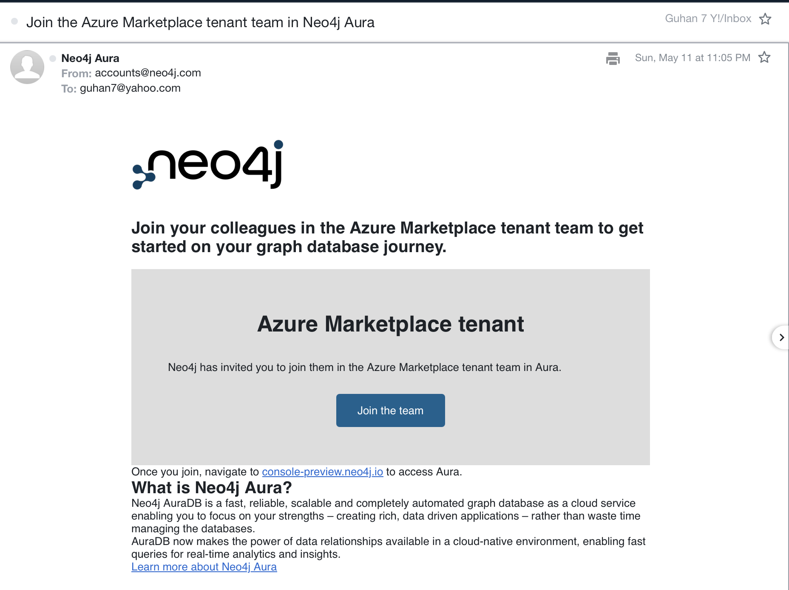

**Step 2: Join the Team**

Open the email and click on "Join the Team".

**Step 3: Neo4j Console Access**

You'll be directed to the Neo4j console in your browser.

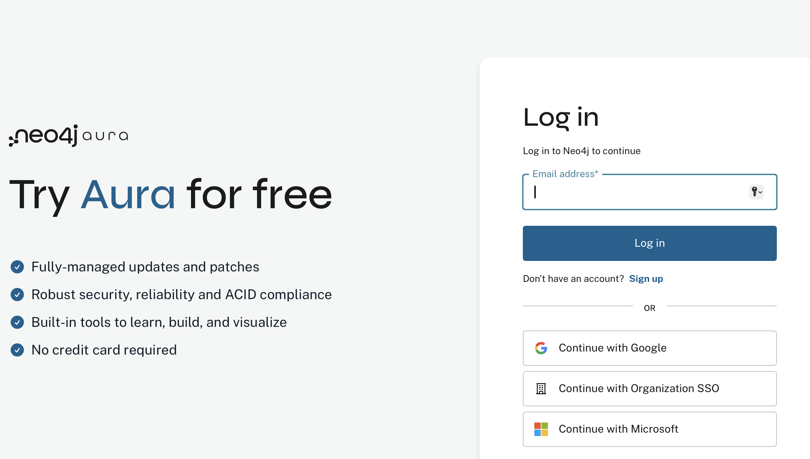

**Step 4: Your Login Email**

Enter the email address provided to the Neo4j team and click "Login".

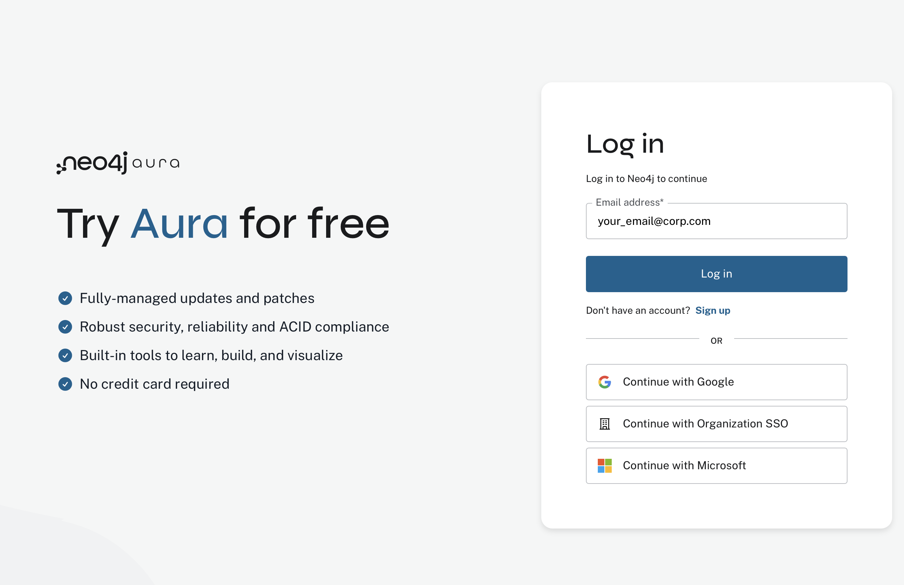

**Step 5: Set Your Password**

If it's your first time, create a new password according to the policy.

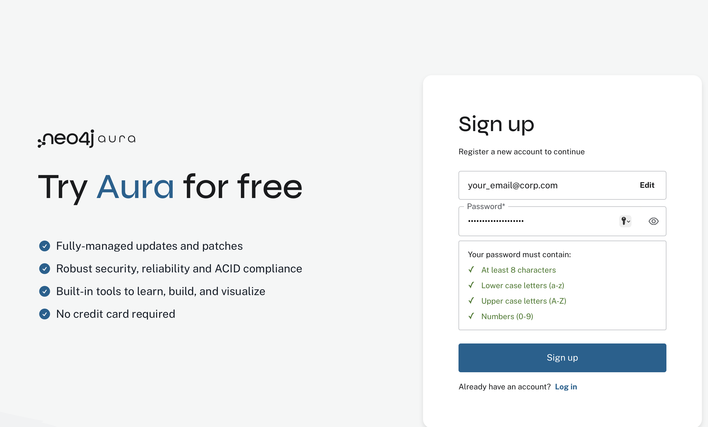

**Step 6: Sign Up Complete**

Click "Sign up". This is your Neo4j Console.

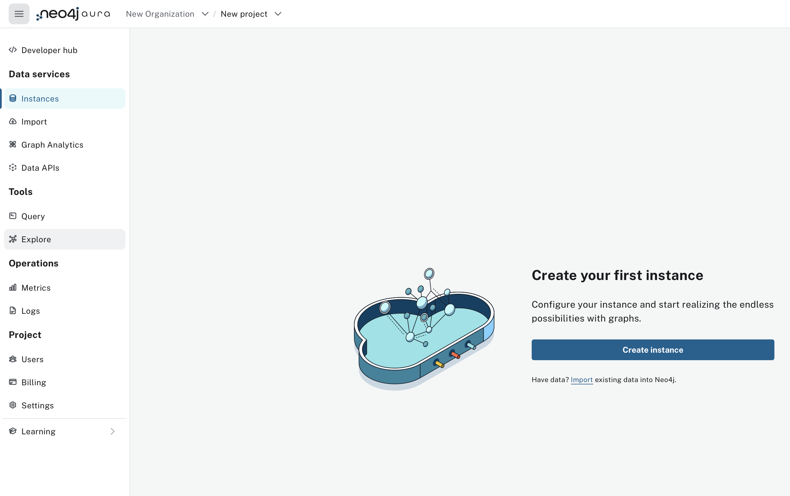

**Step 7: Access the Marketplace tenant**

Click the "New Organization" dropdown (next to "Neo4j Aura"), select the "Marketplace Organization".

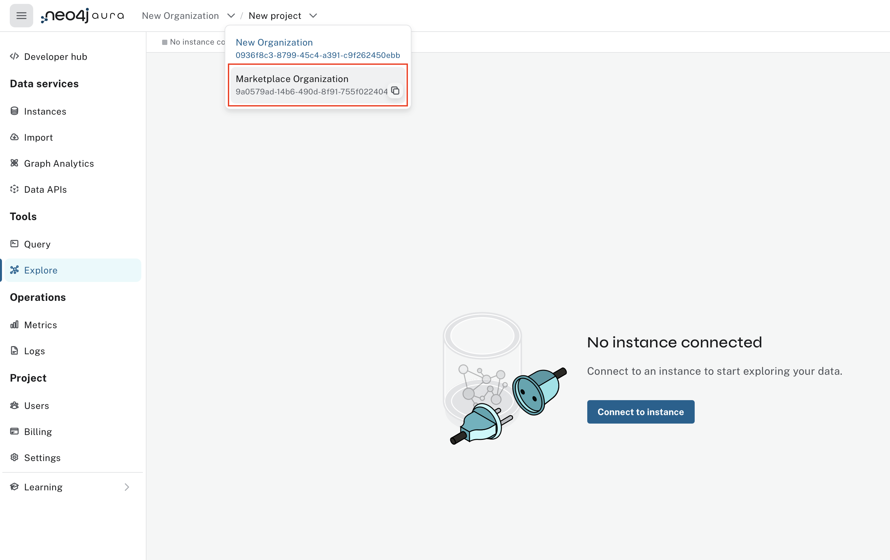

Choose the "Azure Marketplace tenant".

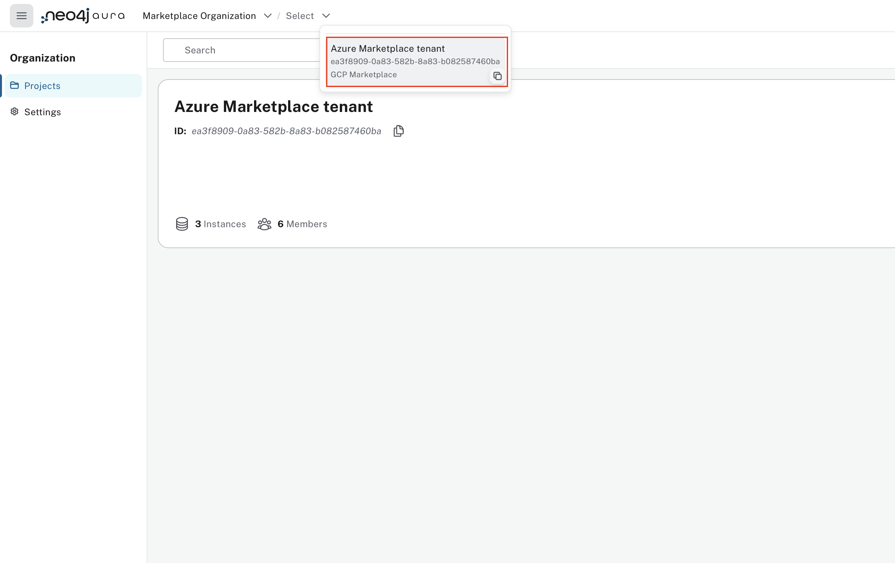

**Step 8: Connect with Credentials**

In the left menu, click "Explore". 

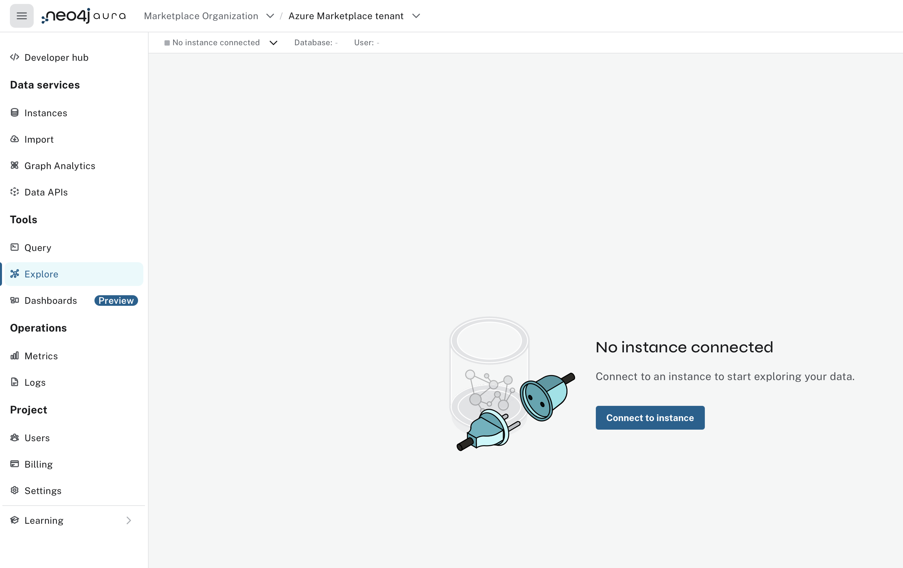

In the popup, find your workshop instance and click the 'v' button next to "Connect", then select "Connect with Credentials".

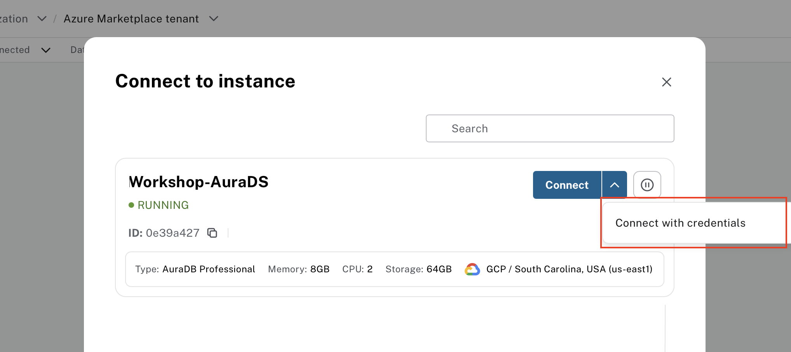

**Step 9: Choose HTTPS Connection (if the default connection method fails)**

First, try connecting using the 'neo4j+s' protocol, which typically offers better performance. If the system doesn't respond for an extended period or errors out, click the 'v' dropdown under 'Connection Method' and select 'https://'. The HTTPS option uses port 443 and can help if other port (7687) are blocked by your corporate network security policies.  

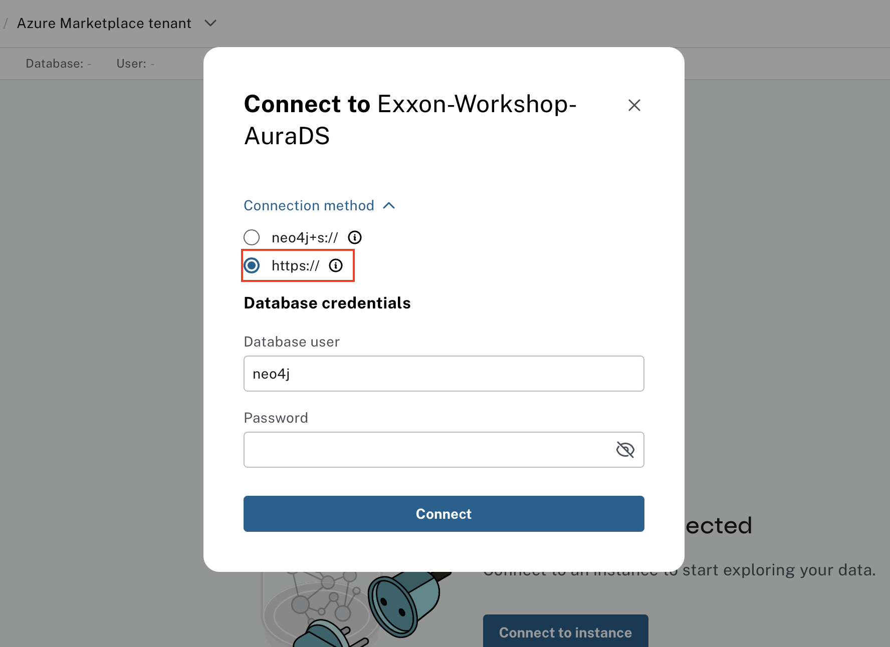

**Step 10: Enter the Instance Password**

Enter the password provided during the workshop.

**Step 11: Welcome to Neo4j!**

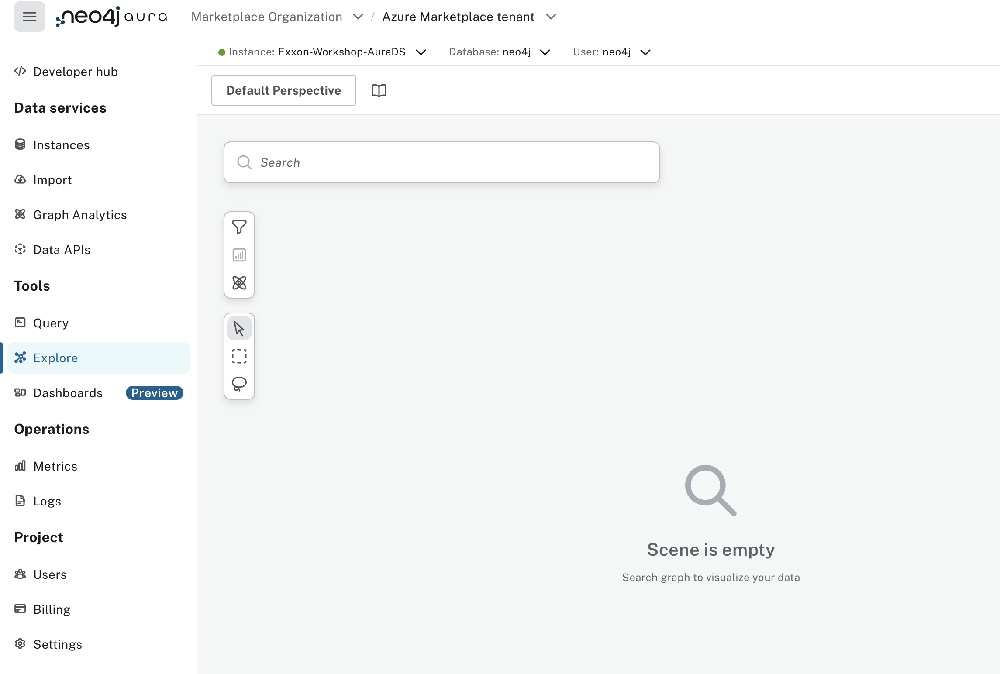

You are now connected to your Neo4j Aura database. Your graph journey begins here. Let's explore!
