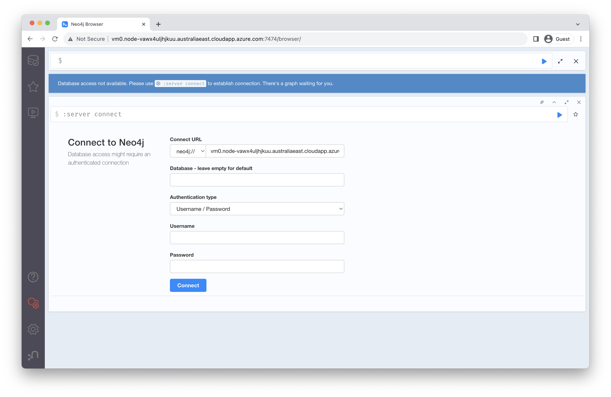
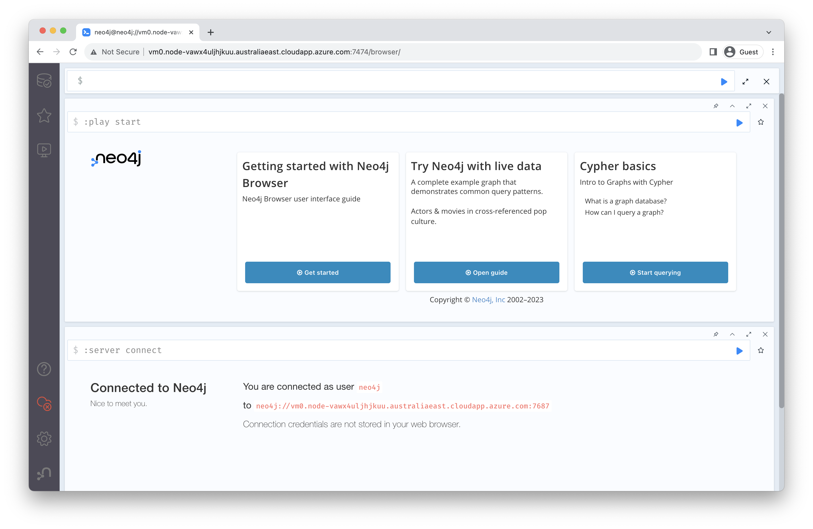
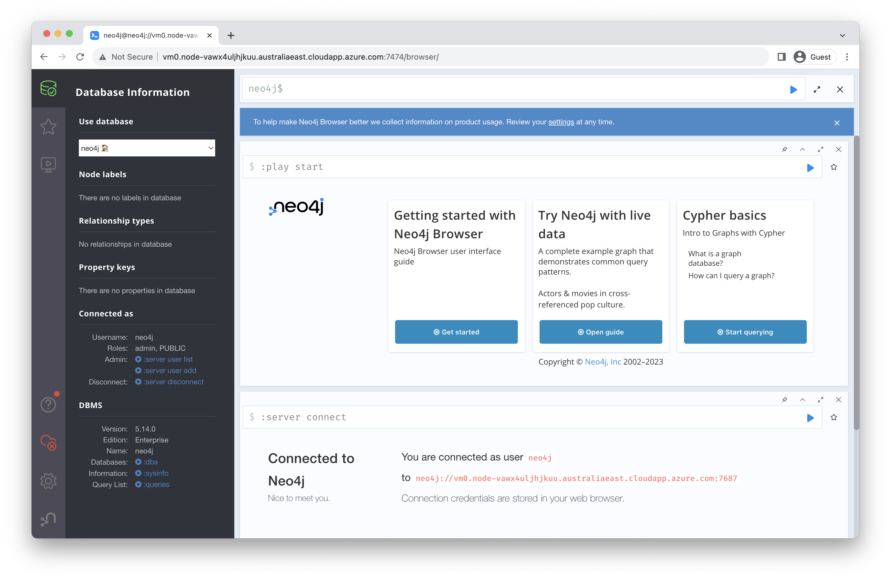
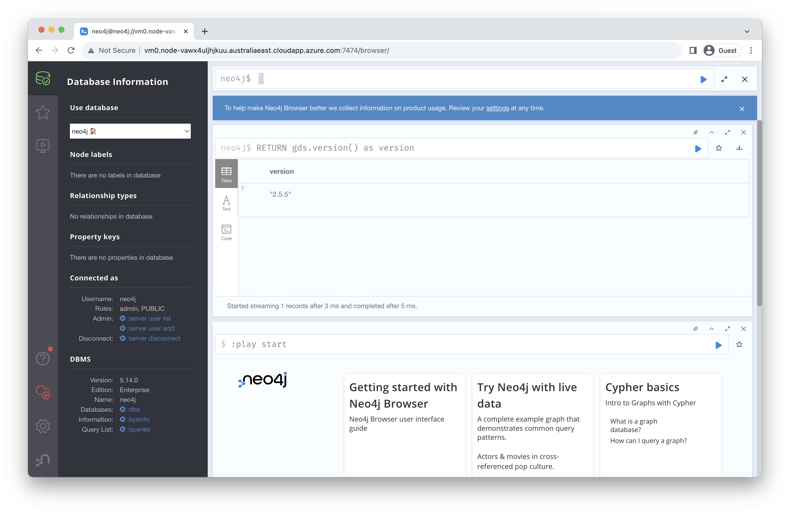
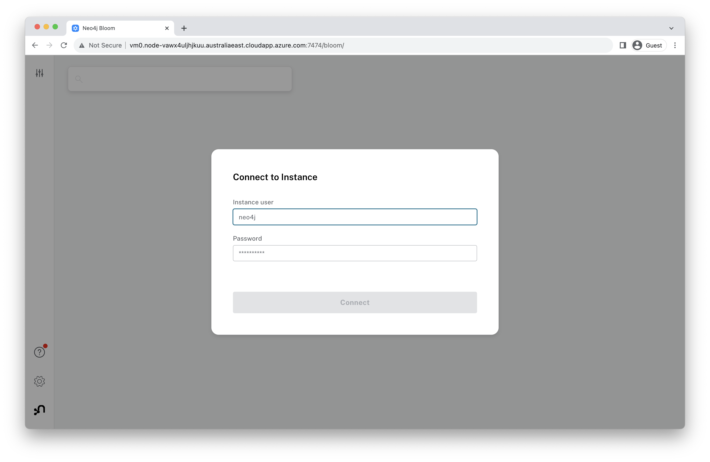
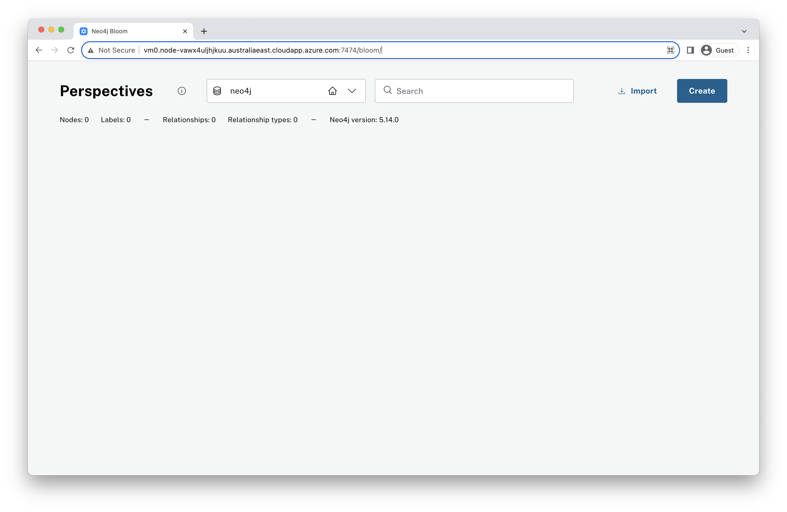

# Lab 2 - Connect to Neo4j
In this lab, we're going to connect to the Neo4j deployment we created in the previous step.

## Neo4j Browser
A quick thing we can do to check that our deployment is running successfully is to open the Neo4j Browser.  To do so, we're going to need the URI we copied down at the end of our last lab.  Paste that into a web browser and open it.  

In my case, the URI was: http://vm0.node-vawx4uljhjkuu.australiaeast.cloudapp.azure.com:7474/

That should open the Neo4j Browser.

The default database is called "neo4j."  We can leave that blank.  For username, enter "neo4j."  For the password, use what we previously chose in the marketplace deployment.  We'd suggested "Foo12345678!" as a password.  Click on "Connect" after entering that information.

You'll be presented with the Neo4j welcome screen at this point.  If you click on the little database icon in the upper left, you can see the contents of our database.

There's nothing in our database yet.  We can see the nodes, relationships and properties areas are all blank.

Before we move on, let's make sure Neo4j Graph Data Science (GDS) is all set up.  We can do that by entering the following command into the Neo4j Browser:

    RETURN gds.version() as version

Then hit the little blue triangle play button to run it.  You should see the following.

Assuming that all looks good, let's move on...

## Neo4j Bloom
Neo4j Bloom is a business intelligence (BI) tool.  It's running on that same 7474 port that the Neo4j Browser was.  So, to open it up, we can just edit that url slightly by add "bloom" to the end of it and hitting enter.  

Alternatively we call copy the Bloom URL from the Azure Portal.

In my case, the URL was "http://vm0.node-vawx4uljhjkuu.australiaeast.cloudapp.azure.com:7474/bloom"

You can login with the same username and password from before.  Enter those and click "Connect."

That's it.  If you got here, Bloom is installed and running.

