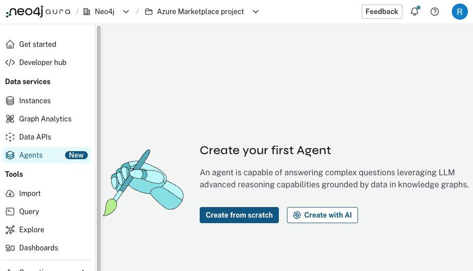
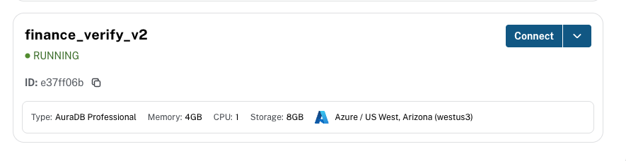
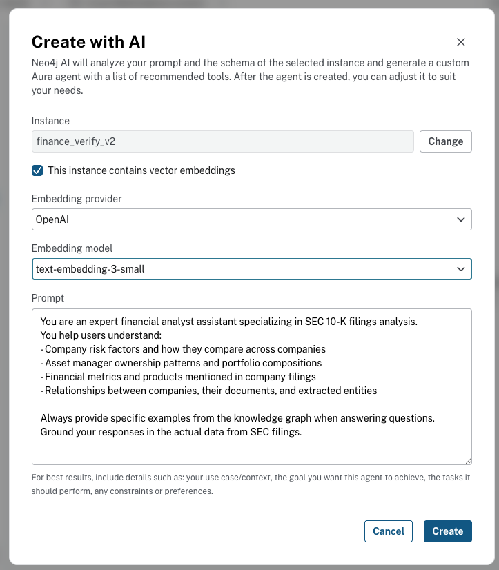
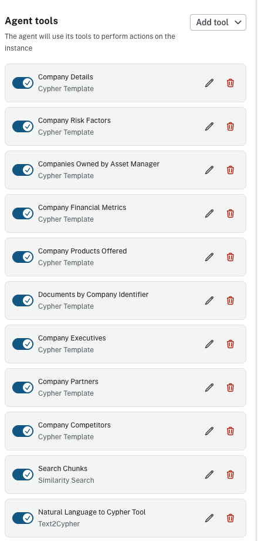
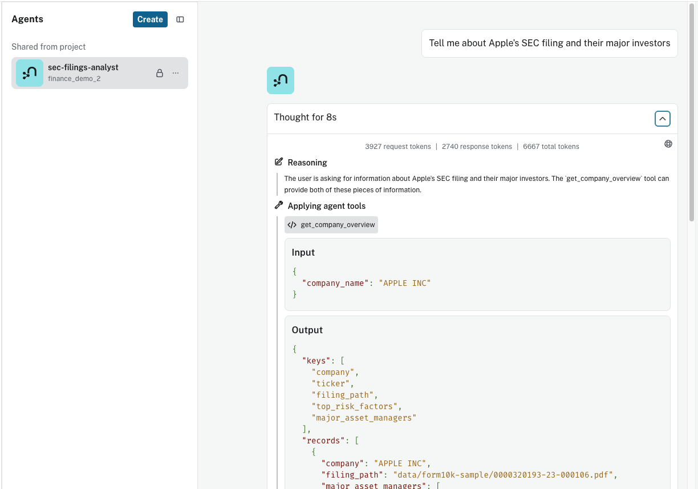

# Lab 2: Aura Agents

Neo4j Aura Agents combine semantic search, graph traversal, and natural language queries into a single conversational interface. In this lab, you will use the "Create with AI" workflow to build an agent that analyzes SEC 10-K filings. Neo4j inspects your knowledge graph schema and automatically generates the tools the agent needs, so there is no code to write and no Cypher templates to configure manually.

## Prerequisites

- Completed **Lab 0** (Azure sign-in)
- Completed **Lab 1** (Neo4j Aura setup with backup restored)

The pre-built backup you restored in Lab 1 already contains the complete knowledge graph with embeddings, so you can start building agents immediately.

## Step 1: Navigate to Agents

1. Go to [console.neo4j.io](https://console.neo4j.io)
2. Select **Agents** in the left-hand menu
3. Click **Create with AI**

The "Create with AI" option lets Neo4j analyze your graph schema and generate a fully configured agent with recommended tools.



## Step 2: Connect Your Neo4j Instance

Select the Neo4j instance you provisioned in Lab 1. The instance should show a **RUNNING** status.



## Step 3: Configure AI Settings

The "Create with AI" dialog needs three pieces of configuration: the embedding provider, the embedding model, and a prompt describing what the agent should do.



Configure the following settings:

- **Instance:** Your Lab 1 instance (pre-selected from Step 2)
- Check **This instance contains vector embeddings**
- **Embedding provider:** `OpenAI`
- **Embedding model:** `text-embedding-3-small`

**Prompt:**
```
You are an expert financial analyst assistant specializing in SEC 10-K filings analysis.
You help users understand:
- Company risk factors and how they compare across companies
- Asset manager ownership patterns and portfolio compositions
- Financial metrics and products mentioned in company filings
- Relationships between companies, their documents, and extracted entities

Always provide specific examples from the knowledge graph when answering questions.
Ground your responses in the actual data from SEC filings.
```

Click **Create**. Neo4j will analyze the graph schema and generate the agent along with its tools.

## Step 4: Review the Generated Tools

After creation, the agent appears with a full set of auto-generated tools. Neo4j derived these from the node labels, relationship types, and indexes in your knowledge graph.



The generated tools fall into three categories:

| Tool Type | Generated Tools |
|-----------|----------------|
| **Cypher Templates** | Company Details, Company Risk Factors, Companies Owned by Asset Manager, Company Financial Metrics, Company Products Offered, Documents by Company Identifier, Company Executives |
| **Similarity Search** | Search Chunks |
| **Text2Cypher** | Natural Language to Cypher Tool |

Each Cypher Template tool maps to a specific traversal pattern in the graph. The Similarity Search tool uses the `chunkEmbeddings` vector index to find semantically relevant filing passages. The Text2Cypher tool translates arbitrary natural language questions into Cypher queries for ad-hoc exploration.

## Step 5: Test the Agent

Test your agent with the sample questions below. After each test, observe:
1. Which tool the agent selected and why
2. The context retrieved from the knowledge graph
3. How the agent synthesized the response

### Cypher Template Questions

Try asking: **"Tell me about Apple Inc. including their risk factors, products, and major institutional investors"**

The agent recognizes this as a company lookup, selects the appropriate Cypher Template tool, and executes a graph traversal to retrieve Apple's filing details, risk factors, and institutional owners.



The reasoning panel shows the agent's decision process: it identified the question as a company overview request and selected the `get_company_overview` tool with `"APPLE INC"` as the parameter.

Other Cypher Template questions to try:
- "What risks do Apple Inc. and Microsoft Corporation share?" - Compares risk factor nodes connected to both companies.
- "Which companies does BlackRock Inc. own shares in?" - Traverses the OWNS relationships from the AssetManager node.
- "What products does NVIDIA Corporation offer?" - Retrieves Product nodes linked to NVIDIA, returning GPU architectures, platforms, and software services.
- "Who are the executives at NVIDIA Corporation?" - Traverses HAS_EXECUTIVE relationships to list leadership names and titles.
- "Show me the documents filed by Apple Inc." - Uses the Documents by Company Identifier tool to retrieve SEC filing metadata.

### Semantic Search Questions

Try asking: **"What do the filings say about AI and machine learning?"**

The agent uses the Similarity Search tool to find semantically relevant passages from SEC filings, then synthesizes insights across multiple companies' discussions of AI.

Other semantic search questions to try:
- "Find content about supply chain risks" - Searches for passages discussing supply chain challenges and dependencies.
- "What do companies say about climate change?" - Finds relevant environmental risk disclosures across filings.
- "Find content about cybersecurity risks and data breaches" - Searches for passages about cyberattacks, ransomware, and data protection across filings.

### Text2Cypher Questions

Try asking: **"How many products does NVIDIA Corporation mention?"**

The agent translates this natural language question into a Cypher query that counts Product nodes linked to NVIDIA and returns the result.

Other Text2Cypher questions to try:
- "What executives does NVIDIA Corporation have?" - Generates a query to find Executive nodes and their titles associated with NVIDIA.

## Step 6: (Optional) Deploy to API

Deploy your agent to a production endpoint:
1. Click **Deploy** in the Aura Agent console
2. Copy the authenticated API endpoint
3. Use the endpoint in your applications

## Step 7: (Optional) Connect as an MCP Server

You can connect your Aura Agent to MCP-compatible clients like Claude Code, Claude Desktop, VS Code, or Cursor. This gives the client direct access to all the agent tools you just tested, without writing any code.

See the full setup guide: **[MCP Server Setup](mcp_setup.md)**

The quick version:

1. **Enable External access and MCP server** on your agent (see [Configure](images/6_option_mcp_setup.png))
2. **Copy the MCP server endpoint URL** from the agent menu (see [Copy Endpoint](images/7_option_mcp.png))
3. **Get your API credentials** from Account Settings → API Keys
4. **Configure your client** using the `.env.example` and `.mcp.json.template` files in this directory

## Summary

The "Create with AI" workflow generated an agent with three retrieval patterns, each suited to different question types:

| Tool Type | Purpose | Best For |
|-----------|---------|----------|
| **Cypher Templates** | Controlled, precise graph traversals | Specific lookups, comparisons |
| **Similarity Search** | Semantic retrieval over filing text | Finding relevant content by meaning |
| **Text2Cypher** | Flexible natural language to Cypher | Ad-hoc questions about the data |

These same patterns are implemented programmatically in Labs 6 and 7 using Python and the Neo4j GraphRAG package.

## Next Steps

After completing this lab, continue to [Lab 3 - Foundry Setup](../Lab_3_Foundry_Setup) to set up your Microsoft Foundry project.

**This completes Part 1 (No-Code Track) of the workshop.** To continue with the coding labs, proceed to [Lab 4 - Start Codespace](../Lab_4_Start_Codespace).
