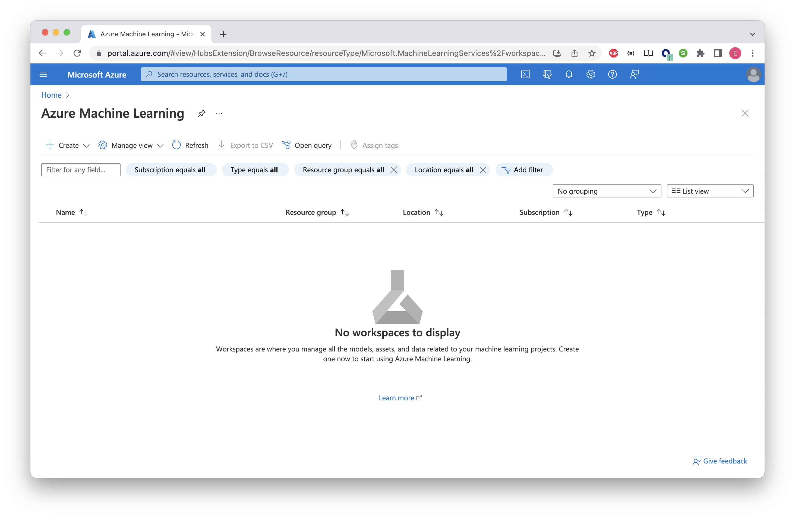
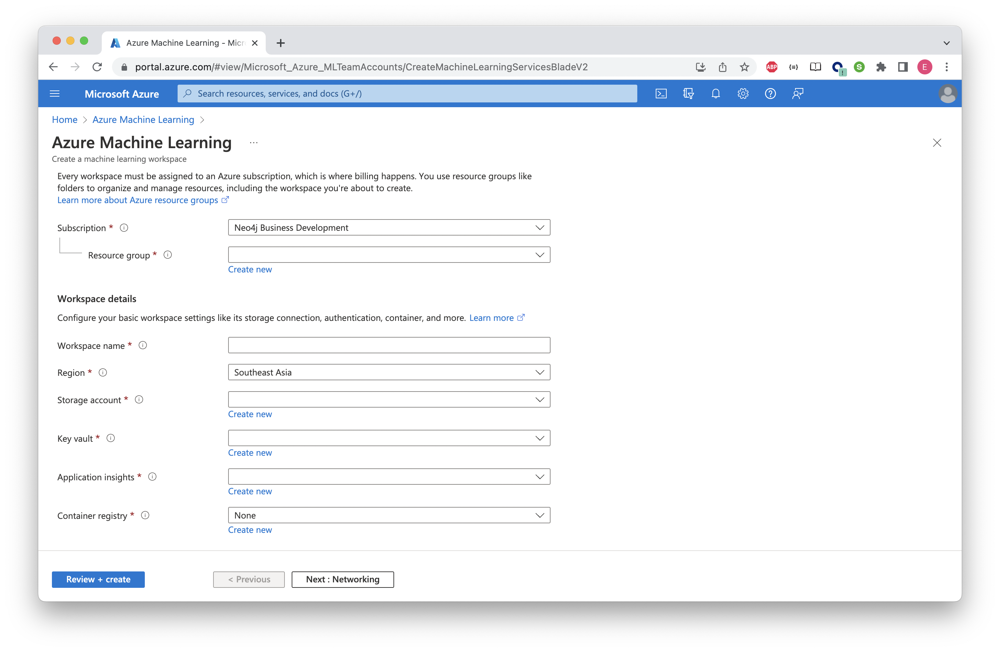
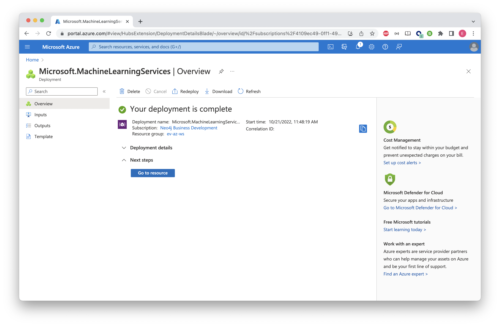
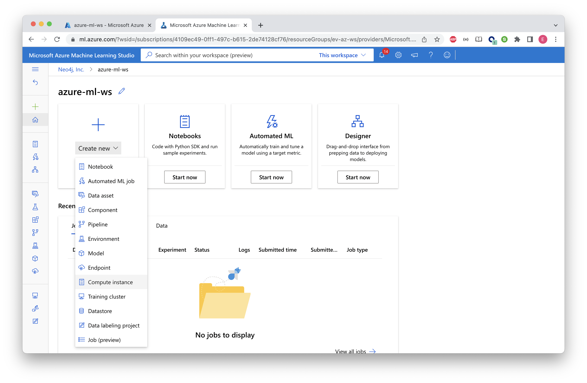
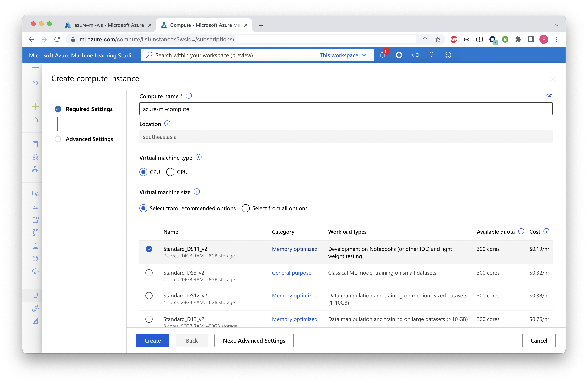
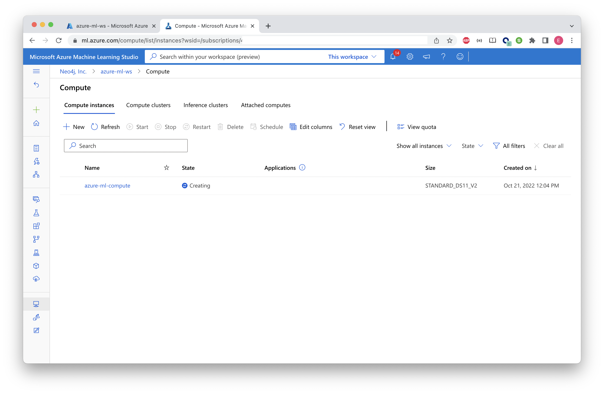
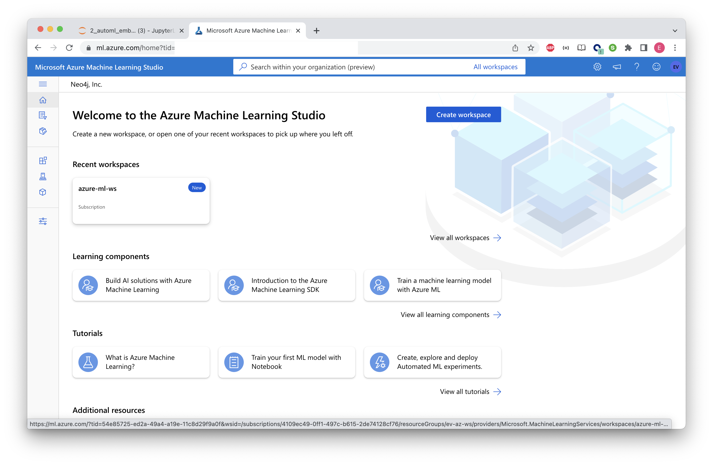
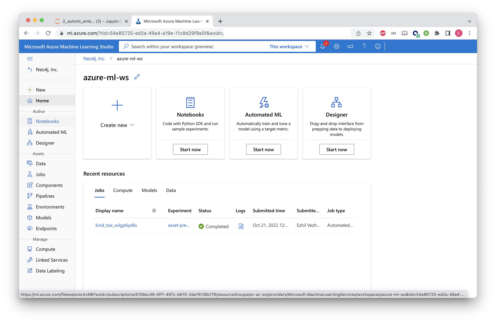
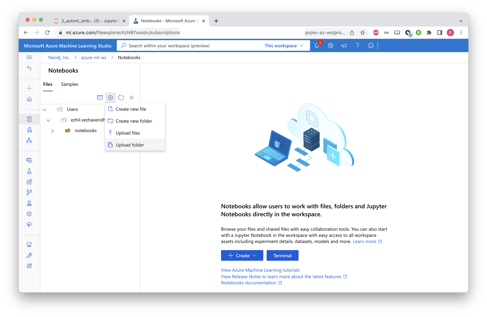

# Lab 5 - Azure ML
In this lab we're going to spin up an Azure Machine Learning service.  We'll then use it to run two notebooks.  In later a later lab, we'll use it for supervised machine learning with AutoML and MLFlow.  AutoML attempts to featurize and tune models automatically, simplifying the task of creating a machine learning model.

## Create an Azure ML service
The first step is to deploy an Azure ML Service.  To do that, open the Azure portal [here](https://portal.azure.com)

In the search bar, type "Azure Machine Learning."

Click on "Azure Machine Learning" as shown below.

Lets create a new Workspace inside Azure ML

Click on "Create" and select "New workspace"

Provide the required configuration to create a new Workspace.
Select a Resource Group of your choice.

Click on "Review + create". 
Review the configuration and click "Create".

You will see the Dpeloyment complete screen once done.
You can go to the resource by clicking "Go to resource"

Your new Workspace will look similar to this, if everything goes well.

Click on "Launch Studio" to open the Azure ML Studio. This is the place where you can create Notebooks, Compute etc.

Before importing and running Notebooks, let's create a Compute Instance

Provide the Compute name and select a Compute VM Size

After clicking "Create" you will see the Compute Instance in the new page

We are all set to import and run Notebooks now.

## Import from Local computer to ML Studio
For the rest of the labs, we're going to be working with iPython notebooks in ML Studio.  To load them into Studio, we're going to pull them from your local.

- Clone this repository locally to your computer or you can download a Notebook individually and then upload to Azure ML Studio as below:

Click on Notebook menu in the left menu bar

Now, upload the repository folder or files like below

If successful, you will see the Notebooks similar to below

## Cypher
Now we'll run a few queries using the python API.  Earlier we used the graphical interface in the Neo4j Browser.  We're going to do the same thing but in a programmatic way.  Let's start by firing up a notebook.  As you did before, find the `/Users/<YOUR_NAME>/notebooks/hands-on-lab-neo4j-and-azure-ml/Lab 5 - AzureML/1_cypher.ipynb` in the Studio menu, double-click and then run through the notebook.
