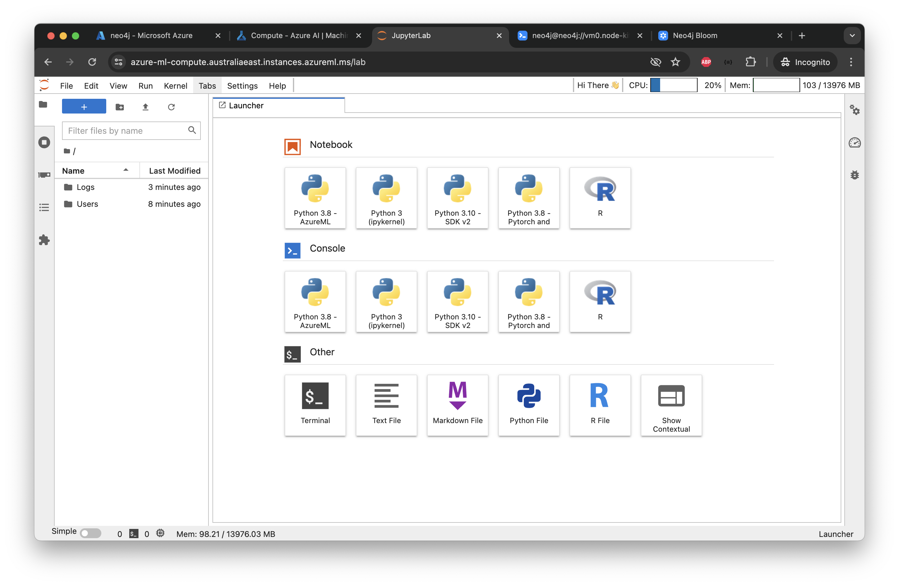

# Lab 5 - Parsing Data
In this lab we're going to parse data with generative AI to create a knowledge graph. We'll use the generative AI functionality in Google Cloud Vertex AI.

We'll be using some of the same data we loaded from a CSV earlier. However, this time, we'll parse the raw files from the SEC. This is really neat as we're using generative AI to parse something that required complex python scripts. Essentially we're trading generative AI compute time for developer time. Making this sort of trade possible is exactly why computers were invented! In this case, we're sidestepping scripts that took months of effort to harden, so it's an excellent trade.

## Create an Azure ML Service
The first step is to deploy an Azure ML Service.  To do that, open the Azure portal [here](https://portal.azure.com)

In the search bar, type "Azure Machine Learning."

Click on "Azure Machine Learning" as shown below.


Let's create a new Workspace inside Azure ML

Click on "Create" and select "New workspace"


Provide the required configuration to create a new Workspace:

* Resource Group - Select the pre created resource group
* Name - Type a name for the workspace


The other cells will then autopopulate.  Click on "Review + create." 

Review the configuration and click "Create."


You will see the Deployment complete screen once done.

You can go to the resource by clicking "Go to resource."


Your new Workspace will look similar to this, if everything goes well.


Click on "Launch Studio" to open the Azure ML Studio. This is the place where you can create notebooks, compute etc.


Before importing and running notebooks, let's create a compute instance.


Provide the compute name and select "Standard_DS11_v2" for the compute VM Size.


Click "Review + Create" 
After clicking "Create" you will see the compute instance in the new page.


Click "JupyterLab". You will see a new window of JupyterLab.

## Import Lab Notebooks to JupyterLab
For the rest of the labs, we're going to be working with JupyterLab.



Clone this repository to JupyterLab as below:

* Click on the `Terminal` icon in the Launcher window to open a terminal where you can run the following command

```
git clone https://github.com/neo4j-partners/hands-on-lab-neo4j-and-azure.git
```


Hit the refresh icon after cloning. You will see the cloned respository folder.

Now we'll run a few queries using the python API.  Earlier we used the graphical interface in the Neo4j Browser.  We're going to do the same thing but in a programmatic way.  Let's start by firing up a notebook.  Find the `/hands-on-lab-neo4j-and-azure-ml/Lab 5 - Parsing Data/parsing-data.ipynb` in the left navigation bar, double-click and then run through the notebook.
