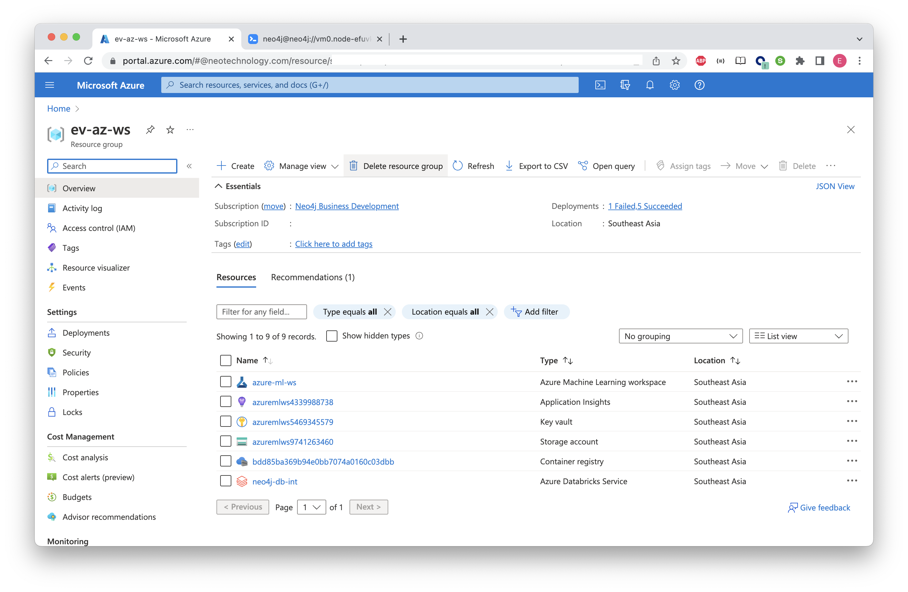

# Lab 7 - Cleanup
We deployed a lot of resources in these labs.  Clearly, you want to make sure they don't run up a bill from unused Azure resources.  In this section we'll work through deleting them.

## Delete the Neo4j Deployment
We can go ahead and delete it, even if your AutoML job is still running.  You've already exported the data from Neo4j to AutoML, so deleting it won't impact that job.

At any rate, to delete it, log into the Azure Portal [here](https://portal.azure.com/#view/HubsExtension/BrowseResourceGroups).  Click on the "Resource Group" where you installed the Neo4j Graph Platform.

Click "Delete Resource Group"

## Delete Azure ML
At any rate, to delete it, log into the Azure Portal [here](https://portal.azure.com/#view/HubsExtension/BrowseResourceGroups).  Click on the "Resource Group" where you installed the Azure ML Platform.

Click "Delete Resource Group"

