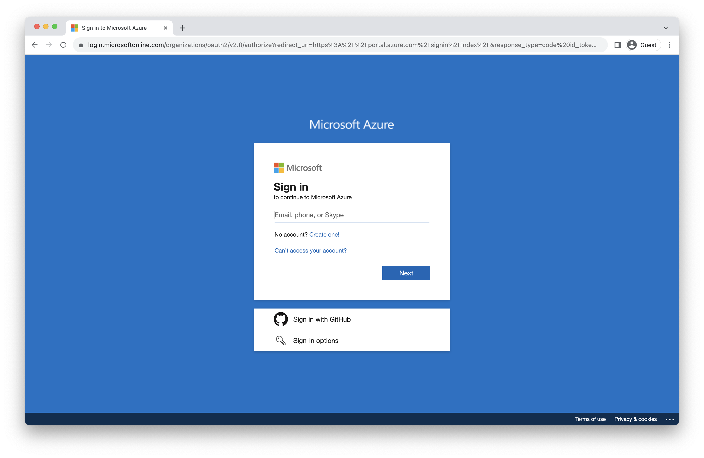
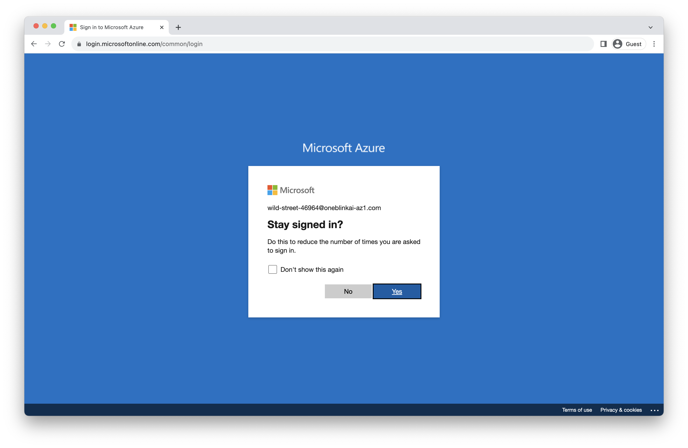

# Lab 0 - Sign In

**Important:** During the sign-up process, be sure to save your Resource Group name as it will be needed throughout the labs.

At the end of the first presentation, you will receive an event code. To begin the lab, visit [https://events.oneblink.ai](https://events.oneblink.ai) and enter the email you used to register along with the 7-digit event code. Check the box to agree to the Terms and Conditions, then click on Register.

Check your mailbox to get the OneBlink validation code, then copy the code.

Enter your email, the event code from the information sheet, and the validation code from your email, then click on the "Access Sandbox" button.

Once the entered information is validated, you will receive your own AWS and Neo4j accounts. Please refrain from sharing this account information with fellow attendees, as it is specifically assigned to you. Remember to save this information, as you will need it until the end of the lab. These accounts will be terminated by the end of the day.

**Important:** Leave this window open or copy the Resource Group name from this screen now, as you will need it for the upcoming labs:

## Improving the Labs
As you work through these labs, we'd really appreciate your feedback.  One way to help us improve is to open an issue by going [here](https://github.com/neo4j-partners/neo4j-and-azure-lab/issues).  Outright bugs, usability suggestions, and general comments are all appreciated.  Pull requests are great too!

## Sign into Azure
We're going to sign into a new Azure account.  You may already have other Azure accounts.  If you use Chrome, you might consider using a guest profile for these exercises.  That's not mandatory though and other browsers work fine too.
Our next step is to open the Azure portal [here](https://portal.azure.com/). 

Enter the email address you were given for this lab and click "Next."

Now enter the password you were given and click "Sign in."

Check the box for "Don't show this again" and click yes to continue sign in.

We're now authenticated and logged into the Azure portal.  Click "Maybe later" to dismiss the tour.

