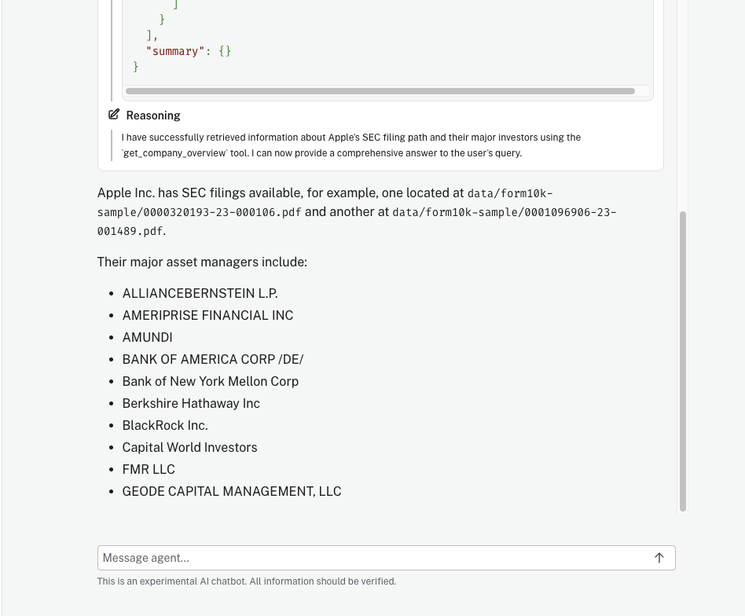

# Build an Aura Agent for SEC Filings Analysis

In this section, you will build an AI-powered agent using Neo4j Aura Agent. The agent will help users analyze SEC 10-K filings by combining semantic search, graph traversal, and natural language queries.

## Prerequisites

- Completed Neo4j Aura signup (Part 1)
- Completed Labs 2 and 3 (knowledge graph built with embeddings)

## Step 1: Create the SEC Filings Agent

1. Go to [console.neo4j.io](https://console.neo4j.io)
2. Select **Agents** in the left-hand menu
3. Click on **Create Agent**


## Step 2: Configure Agent Details

Configure your new agent with the following settings:

**Agent Name:** `sec-filings-analyst`

**Description:** An AI-powered financial analyst that helps users explore SEC 10-K filings, analyze company risk factors, investigate asset manager ownership patterns, and discover relationships across the knowledge graph.

**System Instructions:**
```
You are an expert financial analyst assistant specializing in SEC 10-K filings analysis.
You help users understand:
- Company risk factors and how they compare across companies
- Asset manager ownership patterns and portfolio compositions
- Financial metrics and products mentioned in company filings
- Relationships between companies, their documents, and extracted entities

Always provide specific examples from the knowledge graph when answering questions.
Ground your responses in the actual data from SEC filings.
```


## Step 3: Add Cypher Template Tools

Click **Add Tool** and select **Cypher Template** for each of the following tools:

### Tool 1: Get Company Overview

**Tool Name:** `get_company_overview`

**Description:** Get comprehensive overview of a company including their SEC filing, risk factors, and major institutional owners.

**Parameters:** `company_name` (string) - The company name to look up (e.g., "APPLE INC", "NVIDIA CORPORATION")

**Cypher Query:**
```cypher
MATCH (c:Company {name: $company_name})
OPTIONAL MATCH (c)-[:FILED]->(d:Document)
OPTIONAL MATCH (c)-[:FACES_RISK]->(r:RiskFactor)
OPTIONAL MATCH (am:AssetManager)-[:OWNS]->(c)
WITH c, d,
     collect(DISTINCT r.name)[0..10] AS risks,
     collect(DISTINCT am.managerName)[0..10] AS owners
RETURN
    c.name AS company,
    c.ticker AS ticker,
    d.path AS filing_path,
    risks AS top_risk_factors,
    owners AS major_asset_managers
```


### Tool 2: Find Shared Risks Between Companies

**Tool Name:** `find_shared_risks`

**Description:** Find risk factors that two companies have in common from their SEC filings.

**Parameters:**
- `company1` (string) - First company name
- `company2` (string) - Second company name

**Cypher Query:**
```cypher
MATCH (c1:Company)-[:FACES_RISK]->(r:RiskFactor)<-[:FACES_RISK]-(c2:Company)
WHERE c1.name = $company1 AND c2.name = $company2
WITH c1, c2, collect(DISTINCT r.name) AS shared_risks
RETURN
    c1.name AS company_1,
    c2.name AS company_2,
    shared_risks,
    size(shared_risks) AS num_shared_risks
```


## Step 4: Add Similarity Search Tool

Click **Add Tool** and select **Similarity Search** to configure a semantic search tool using the existing vector index:

**Tool Name:** `search_filing_content`

**Description:** Search SEC filing content semantically to find relevant passages about specific topics, risks, or business information.

**Configuration:**
- **Vector Index:** `chunkEmbeddings`
- **Return Properties:** `text`
- **Top K:** 5

**Retrieval Query (for enhanced context):**
```cypher
MATCH (node)-[:FROM_DOCUMENT]-(doc:Document)-[:FILED]-(company:Company)
OPTIONAL MATCH (company)-[:FACES_RISK]->(risk:RiskFactor)
WITH node, score, company, collect(DISTINCT risk.name)[0..10] AS risks
RETURN
    node.text AS content,
    score AS relevance,
    company.name AS source_company,
    risks AS company_risks
ORDER BY score DESC
```


## Step 5: Add Text2Cypher Tool

Click **Add Tool** and select **Text2Cypher** to enable natural language to Cypher translation:

**Tool Name:** `query_database`

**Description:** Query the SEC 10-K filings knowledge graph using natural language. This tool translates user questions into Cypher queries to retrieve precise data about companies, their risk factors from SEC filings, institutional ownership by asset managers, financial metrics, products mentioned in filings, and the relationships between these entities. Use this for ad-hoc questions that require flexible data exploration beyond the pre-defined Cypher templates.


## Step 6: Test the Agent

Test your agent with the sample questions below. After each test, observe:
1. Which tool the agent selected and why
2. The context retrieved from the knowledge graph
3. How the agent synthesized the response
4. Tool explanations showing the reasoning process

### Cypher Template Questions

Try asking: **"Tell me about Apple's SEC filing and their major investors"**

The agent recognizes this matches the `get_company_overview` template and executes the pre-defined Cypher query with "APPLE INC" as the parameter.


We can see the agent's reasoning for selecting the `get_company_overview` tool and how it synthesized the response into a readable format:



Other Cypher template questions to try:
- "What risks do Apple and Microsoft share?" - Uses the `find_shared_risks` template to compare risk factors between two companies.

### Semantic Search Questions

Try asking: **"What do the filings say about AI and machine learning?"**

The agent uses the similarity search tool to find semantically relevant passages from SEC filings, then synthesizes insights from Microsoft and NVIDIA's discussions of AI.


Other semantic search questions to try:
- "Find content about supply chain risks" - Searches for passages discussing supply chain challenges and dependencies.
- "What do companies say about climate change?" - Finds relevant environmental risk disclosures across filings.

### Text2Cypher Questions

Try asking: **"Which company has the most risk factors?"**

The agent translates this natural language question into a Cypher query that counts risk factors per company and returns the highest.


Other Text2Cypher questions to try:
- "How many products does NVIDIA mention?" - Generates a query to count Product nodes linked to NVIDIA.
- "What executives are mentioned by Apple?" - Creates a query to find Executive nodes associated with Apple.

## Step 7: (Optional) Deploy to API

Deploy your agent to a production endpoint:
1. Click **Deploy** in the Aura Agent console
2. Copy the authenticated API endpoint
3. Use the endpoint in your applications

## Summary

You have now built an Aura Agent that combines three powerful retrieval patterns:

| Tool Type | Purpose | Best For |
|-----------|---------|----------|
| **Cypher Templates** | Controlled, precise queries | Specific lookups, comparisons |
| **Similarity Search** | Semantic retrieval | Finding relevant content by meaning |
| **Text2Cypher** | Flexible natural language | Ad-hoc questions about the data |

These same patterns are implemented programmatically in Labs 5 and 6 using Python and the Neo4j GraphRAG package.

## Future Tools

These additional Cypher template tools can be added to extend the agent's capabilities:

### Get Asset Manager Portfolio

**Tool Name:** `get_manager_portfolio`

**Description:** Get all companies owned by a specific asset manager and their associated risk factors.

**Parameters:** `manager_name` (string) - The asset manager name (e.g., "BlackRock Inc.", "Berkshire Hathaway Inc")

**Cypher Query:**
```cypher
MATCH (am:AssetManager {managerName: $manager_name})-[o:OWNS]->(c:Company)
OPTIONAL MATCH (c)-[:FACES_RISK]->(r:RiskFactor)
WITH am, c, o, collect(DISTINCT r.name)[0..5] AS company_risks
RETURN
    am.managerName AS asset_manager,
    collect({
        company: c.name,
        ticker: c.ticker,
        position_status: o.position_status,
        key_risks: company_risks
    }) AS portfolio
```

### List All Companies

**Tool Name:** `list_companies`

**Description:** List all companies in the knowledge graph with their risk factor counts.

**Parameters:** None

**Cypher Query:**
```cypher
MATCH (c:Company)
OPTIONAL MATCH (c)-[:FACES_RISK]->(r:RiskFactor)
WITH c, count(r) AS risk_count
RETURN c.name AS company, c.ticker AS ticker, risk_count
ORDER BY risk_count DESC
LIMIT 20
```
