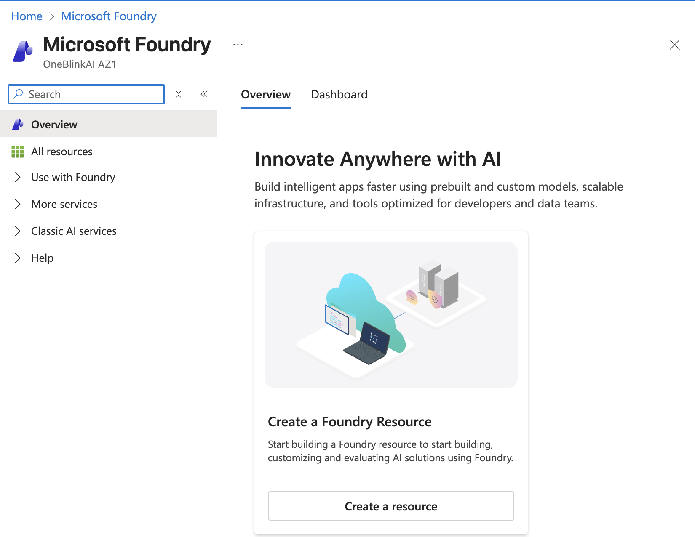
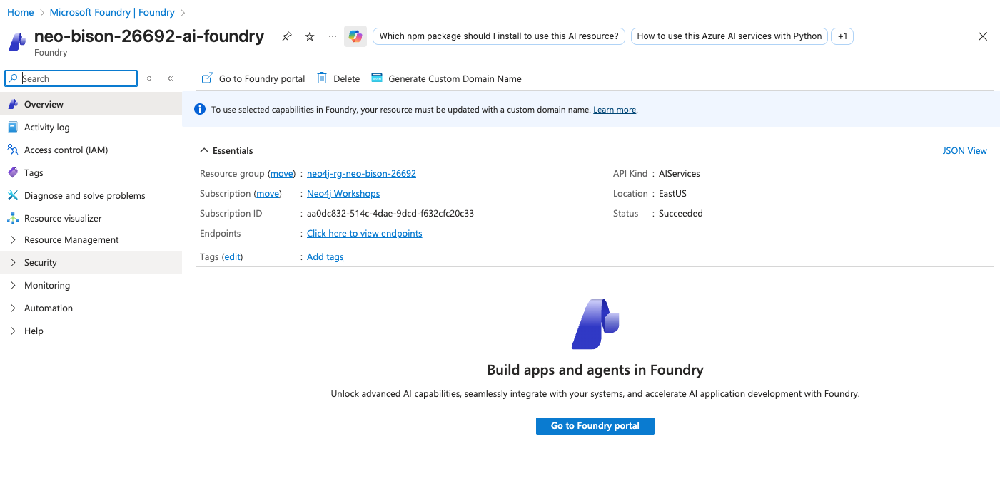
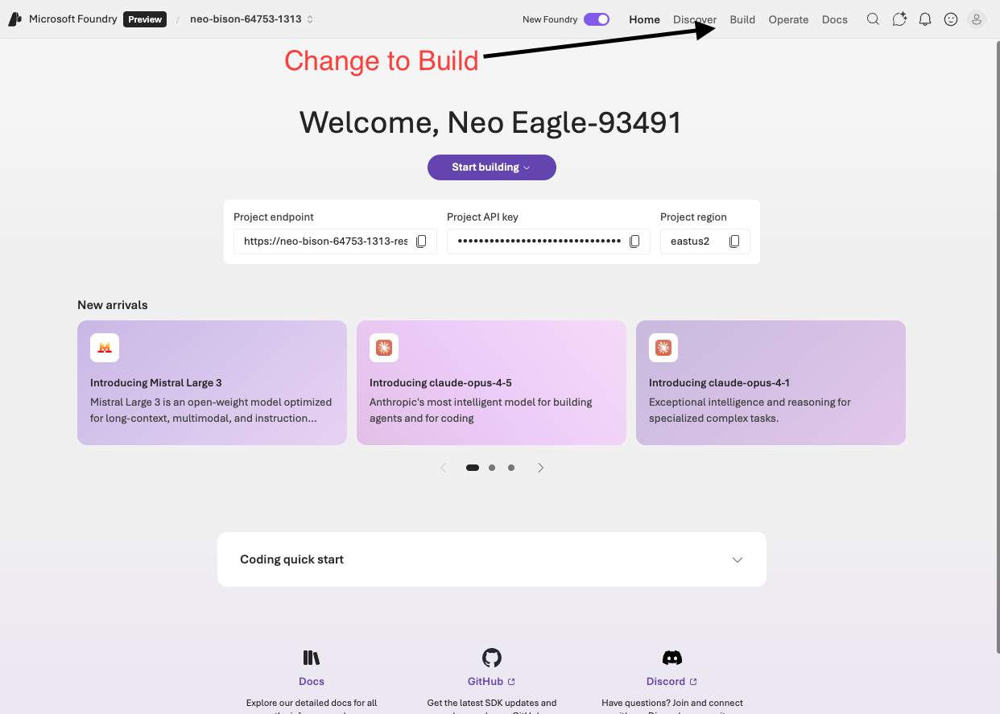
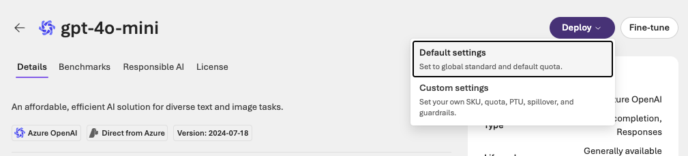
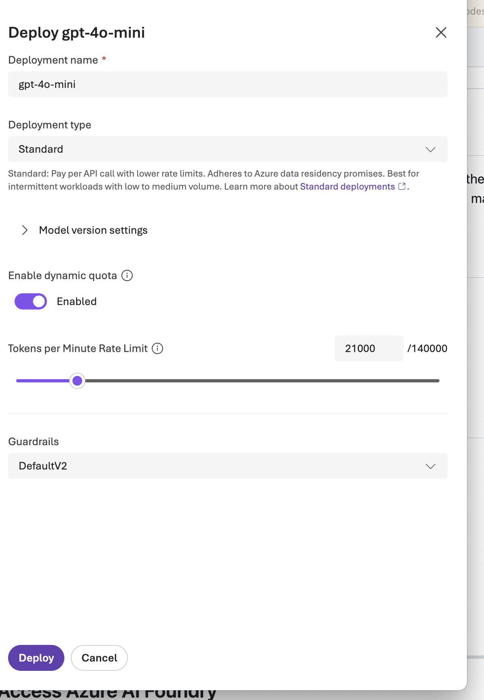
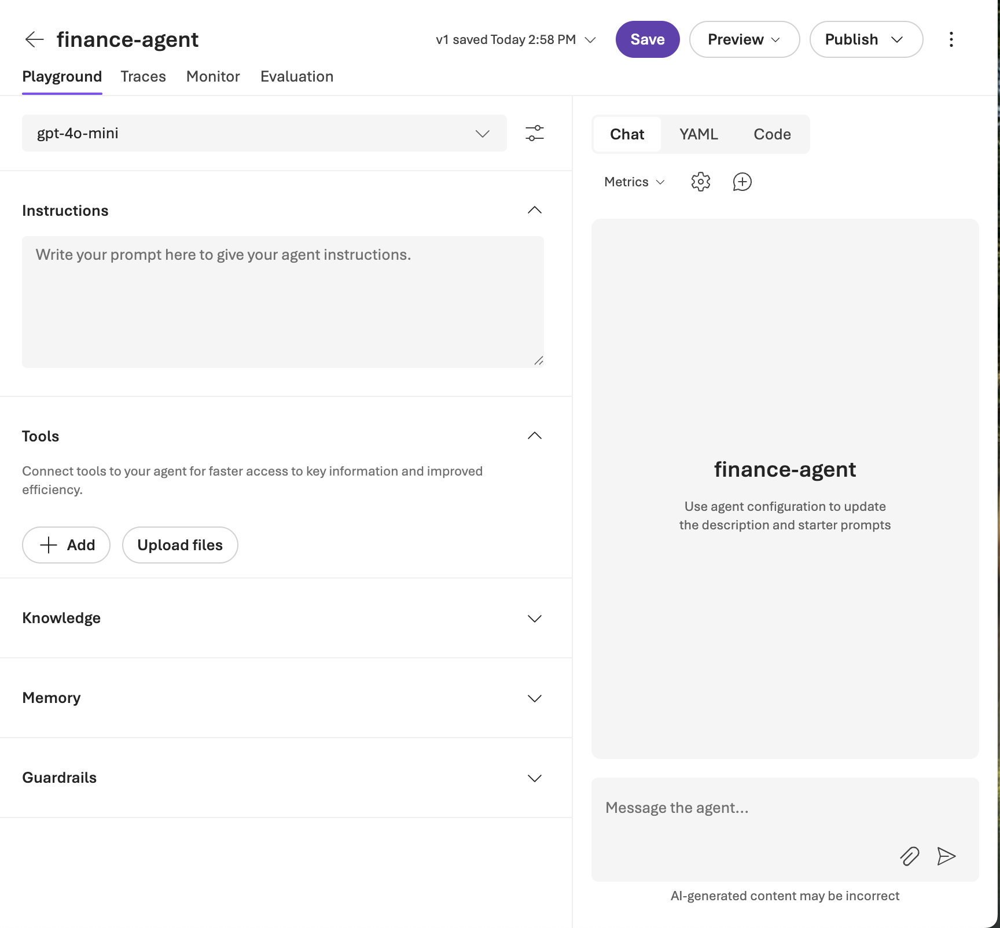
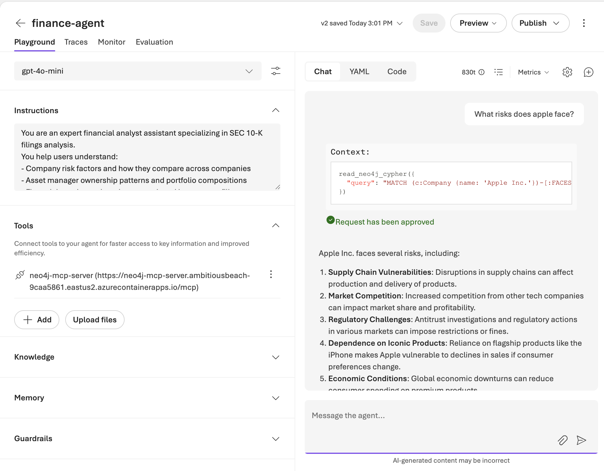

# Lab 3 - Microsoft Foundry Setup

In this lab, you will set up Microsoft Foundry and deploy the AI models needed for the remaining labs. Microsoft Foundry is Microsoft's unified platform for building, deploying, and managing AI applications.

## Prerequisites

Before starting, make sure you have:
- Completed **Lab 0** (Azure sign-in)
- Completed **Lab 1** (Neo4j Aura setup)
- Completed **Lab 2** (Codespace setup)

## What is Microsoft Foundry?

Microsoft Foundry provides:

- **Model Deployments** - Access to GPT-4, GPT-4o-mini, embedding models, and more
- **Agent Framework** - Tools for building AI agents that can use external tools
- **Unified API** - Consistent interface for different AI capabilities

In this lab, you'll deploy:
- **gpt-4o-mini** - For text generation and agent reasoning
---

## Step 1: Access Microsoft Foundry

1. Log into the [Azure Portal](https://portal.azure.com)
2. Click on the **Foundry** icon in the Azure services section


---

## Step 2: Create a Foundry Resource

1. In the Microsoft Foundry overview page, click **Create a resource**



---

## Step 3: Fill Out Foundry Details

1. Select your **Subscription** and **Resource group**
2. Enter a **Name** for your Foundry resource - use your username so it's easy to find
3. Select **East US** as the Region
4. Enter a **Default project name** - use the same name as your username for consistency
5. Click **Next** to continue with the creation


> **Tip:** Using your username for both the resource name and project name makes it easy to identify your resources in a shared environment.

---

## Step 5: Open Your Foundry Project

1. Click on your Foundry resource to open it
2. Click **Go to Foundry portal** to access the Foundry interface



---

## Step 6: Switch to New Foundry Experience

1. Look for the banner at the top promoting the new Microsoft Foundry experience
2. Click **Start building** to switch to the new Foundry interface


> **Note:** After switching to the new Foundry Experience, if the page reloads often or gets stuck close the browser tab and try opening [https://ai.azure.com/nextgen](https://https://ai.azure.com/nextgen) directly. It may take a couple of tries to get it to open.

---

## Step 7: Navigate to Build

1. After your project is created, click on **Build** in the top navigation bar
2. This is where you'll deploy and manage your AI models



---

## Step 8: Deploy gpt-4o-mini Model

1. Click on **Discover** in the top navigation
2. Search for `gpt-4o-mini` in the Models section
3. Select **gpt-4o-mini** (Chat completion, Responses)


4. Click the **Deploy** button dropdown
5. Select **Custom settings** (Global settings will not work)



6. Change the deployment type to **Standard** deployment and reduce the Tokens per Minute Rate Limit to 20000 to avoid quota issues.




---

## Step 9: Verify Your Deployments

After deploying both models, verify they appear in your project:
1. Go to **Build** > **Models**
2. Confirm you see:
   - `gpt-4o-mini`
3. Click on the model, and try it out in the playground

---

## Step 10: Building an Agent

1. Click on **Agents** in the top left navigation and click **Create agent**

2. Create an agent named `finance-agent` with the following Description

**Description:**
```
You are an expert financial analyst assistant specializing in SEC 10-K filings analysis.
You help users understand:
- Company risk factors and how they compare across companies
- Asset manager ownership patterns and portfolio compositions
- Financial metrics and products mentioned in company filings
- Relationships between companies, their documents, and extracted entities

Always provide specific examples from the knowledge graph when answering questions.
Ground your responses in the actual data from SEC filings.
```



3. Add an MCP tool by clicking on **Tools**, then in the dialog go to the **Custom** tab and select **Model Context Protocol (MCP)**


4. YOU HAVE AN AGENT! Now let's test it. Enter a query like "What risks does APPLE INC face?" 

We need to use "APPLE INC" because it does an exact string match for the company name. 

You will see the agent ask you for approval to run the MCP request - click yes. Then you will see the MCP call in the context that it runs along with the results. Also try things like "What is the schema?"



5. Try publishing it and see what your new agent looks like!

---

## Summary

You have now set up Microsoft Foundry with:
- A new Foundry project
- **gpt-4o-mini** deployed for chat completions

## What's Next

Continue to [Lab 4 - Building a Knowledge Graph](../Lab_4_Neo4j_GraphRag/README.md) to build your knowledge graph from SEC filings using entity extraction and embeddings.
