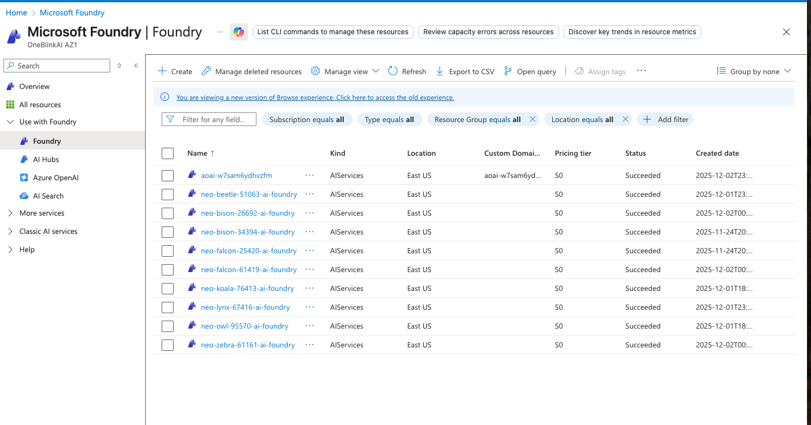
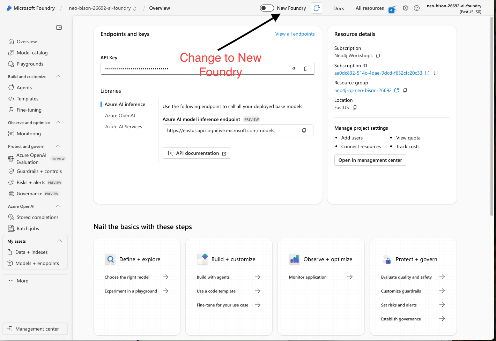
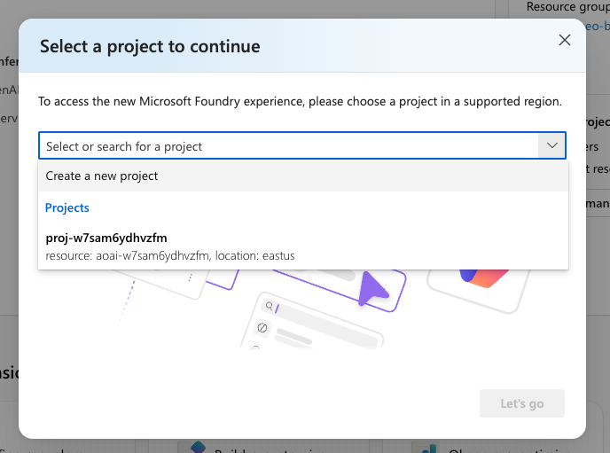

# Lab 3 - Azure AI Foundry Setup

In this lab, you will set up Microsoft Azure AI Foundry and deploy the AI models needed for the remaining labs. Azure AI Foundry is Microsoft's unified platform for building, deploying, and managing AI applications.

## Prerequisites

Before starting, make sure you have:
- Completed **Lab 0** (Azure sign-in)
- Completed **Lab 1** (Neo4j Aura setup)
- Completed **Lab 2** (Codespace setup)

## What is Azure AI Foundry?

Azure AI Foundry provides:

- **Model Deployments** - Access to GPT-4, GPT-4o-mini, embedding models, and more
- **Agent Framework** - Tools for building AI agents that can use external tools
- **Unified API** - Consistent interface for different AI capabilities

In this lab, you'll deploy:
- **gpt-4o-mini** - For text generation and agent reasoning
- **text-embedding-ada-002** - For creating vector embeddings

---

## Step 1: Access Azure AI Foundry

1. Log into the [Azure Portal](https://portal.azure.com)
2. Click on the **Foundry** icon in the Azure services section

---

## Step 2: Find Your Foundry Resource

1. In the Foundry view, look under **Use with Foundry** in the left sidebar
2. Find the Foundry resource that matches your user ID (e.g., `neo-bison-26692-ai-foundry`)

---

## Step 3: Open Your Foundry Project

1. Click on your Foundry resource to open it
2. Click **Go to Foundry portal** to access the Foundry interface

---

## Step 4: Switch to New Foundry Experience

1. Once in Foundry, locate the **New Foundry** toggle in the top navigation bar
2. Enable the **New Foundry** toggle to access the latest features

---

## Step 5: Create a New Project

1. When prompted, select **Create a new project** from the dropdown
2. Click **Advanced options** to configure project settings:
   - **Project**: Enter a name (e.g., `neo-bison-64753-1313`)
   - **Subscription**: Select `Neo4j Workshops`
   - **Resource group**: Select or create a resource group
   - **Region**: Select `East US 2`
3. Click **Create** to create your project

---

## Step 6: Navigate to Build

1. After your project is created, click on **Build** in the top navigation bar
2. This is where you'll deploy and manage your AI models

---

## Step 7: Deploy gpt-4o-mini Model

1. Click on **Discover** in the top navigation
2. Search for `gpt-4o-mini` in the Models section
3. Select **gpt-4o-mini** (Chat completion, Responses)

4. Click the **Deploy** button dropdown
5. Select **Default settings** to deploy with global standard and default quota

Repeat this process to also deploy **text-embedding-ada-002** for embeddings.

---

## Step 8: Verify Your Deployments

After deploying both models, verify they appear in your project:
1. Go to **Build** > **Models + endpoints**
2. Confirm you see both:
   - `gpt-4o-mini`
   - `text-embedding-ada-002`

---

## Summary

You have now set up Azure AI Foundry with:
- A new Foundry project
- **gpt-4o-mini** deployed for chat completions
- **text-embedding-ada-002** deployed for embeddings

These models will be used in the remaining labs to:
- Generate embeddings for vector search (Lab 4)
- Power GraphRAG retrievers (Lab 5)
- Enable intelligent agents (Lab 6)

## What's Next

Continue to [Lab 4 - Building a Knowledge Graph](../Lab_4_Neo4j_GraphRag/README.md) to build your knowledge graph from SEC filings using entity extraction and embeddings.
