# Lab 3 - Microsoft Foundry Setup

In this lab, you will set up Microsoft Foundry and deploy the AI models needed for the remaining labs. Microsoft Foundry is Microsoft's unified platform for building, deploying, and managing AI applications.

## Prerequisites

Before starting, make sure you have:
- Completed **Lab 0** (Azure sign-in)
- Completed **Lab 1** (Neo4j Aura setup)

## What is Microsoft Foundry?

Microsoft Foundry provides:

- **Model Deployments** - Access to GPT-4o, GPT-4o-mini, embedding models, and more
- **Agent Framework** - Tools for building AI agents that can use external tools
- **Unified API** - Consistent interface for different AI capabilities

In this lab, you'll deploy:
- **gpt-4o-mini** or **gpt-4o** - For text generation and agent reasoning
- **text-embedding-3-small** - For creating vector embeddings (used in Part 2 coding labs)
---

## Step 1: Setup Microsoft Foundry

1. Log into the [Azure Portal](https://portal.azure.com)
2. Click on the **Foundry** icon in the Azure services section

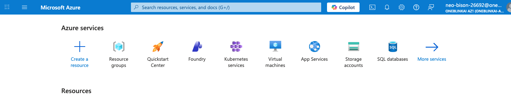

---

## Step 2: Create a Foundry Resource

1. In the Microsoft Foundry overview page, click **Create a resource**

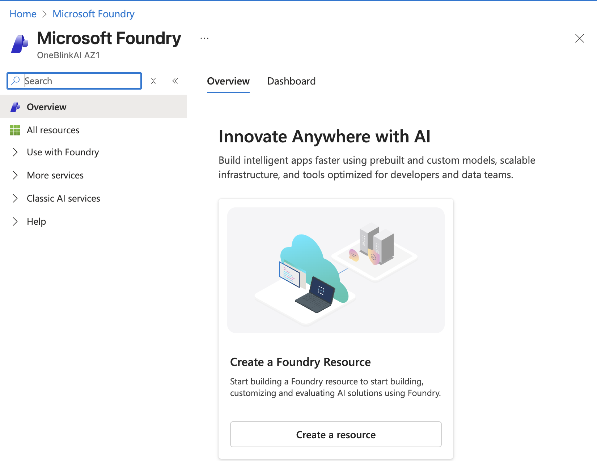

---

## Step 3: Fill Out Foundry Details

1. Select your **Subscription** and **Resource group** — select the existing resource group from Lab 0 (it matches your username). **Do not create a new resource group** — a new resource group will not have the correct permissions and your deployment will fail.
2. Enter a **Name** for your Foundry resource - use your username so it's easy to find
3. Select **East US** as the Region
4. Enter a **Default project name** - use the same name as your username for consistency
5. Click **Next** to continue with the creation

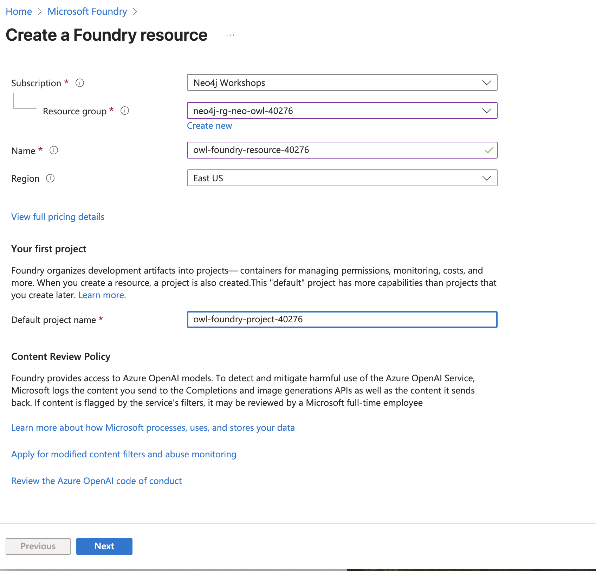

> **Tip:** Using your username for both the resource name and project name makes it easy to identify your resources in a shared environment.

---

## Step 4: Review and Create

Review your settings and click **Create** to provision the Foundry resource. Wait for the deployment to complete before continuing.

---

## Step 5: Open Your Foundry Project

1. Click on your Foundry resource to open it
2. Click **Go to Foundry portal** to access the Foundry interface

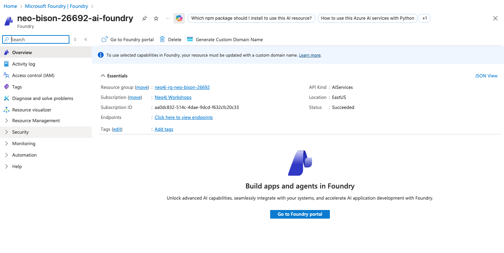

---

## Step 6: Navigate to Build

1. After your project is created, click on **Start building** in the top navigation bar
2. This is where you'll deploy and manage your AI models

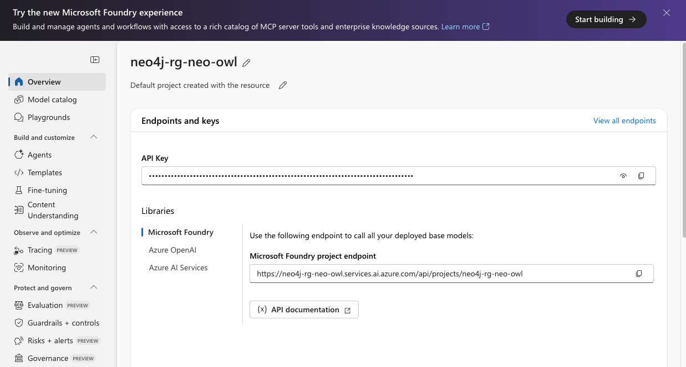

---

## Step 7: Deploy a Model

**gpt-4o-mini** is recommended for this lab as it uses less quota. If you need higher quality responses, you can deploy **gpt-4o** instead.

1. Click on **Discover** in the top navigation
2. Search for `gpt-4o-mini` or `gpt-4o` in the Models section
3. Select your chosen model

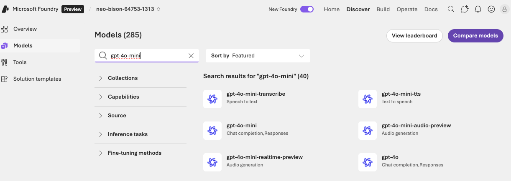

4. Click the **Deploy** button dropdown
5. Select **Custom settings** (Global settings will not work)

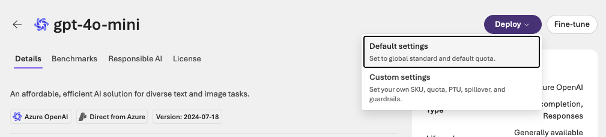

6. Change the deployment type to **Standard** deployment and reduce the Tokens per Minute Rate Limit to 20000 to avoid quota issues.

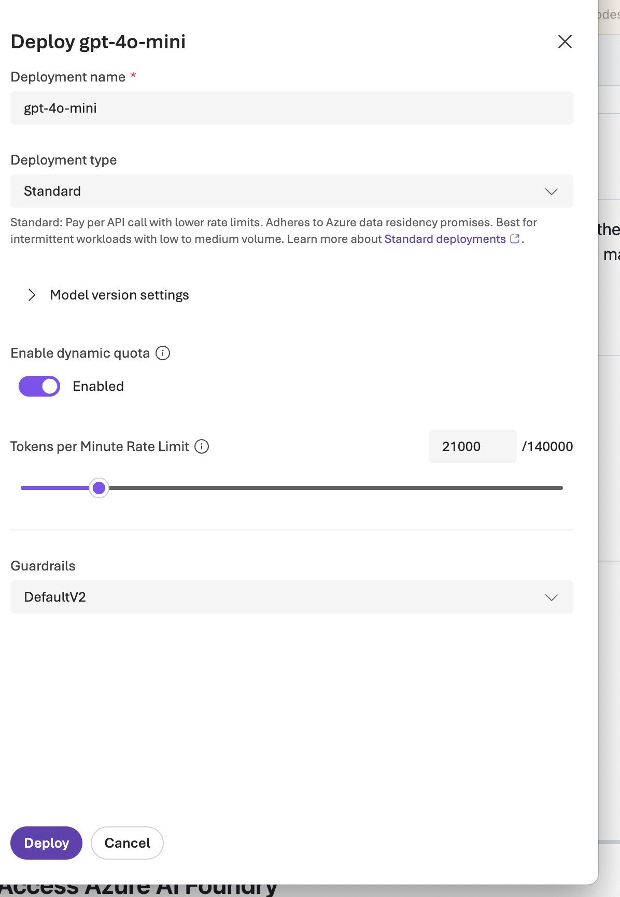


---

## Step 8: Deploy an Embedding Model

The coding labs in Part 2 require an embedding model for vector search. Deploy **text-embedding-3-small** using the same process:

1. Click on **Discover** in the top navigation
2. Search for `text-embedding-3-small` in the Models section
3. Select the model
4. Click the **Deploy** button dropdown
5. Select **Custom settings**
6. Change the deployment type to **Standard** deployment and set the Tokens per Minute Rate Limit to 5000

---

## Step 9: Verify Your Deployments

After deploying the models, verify they appear in your project:
1. Go to **Build** > **Models**
2. Confirm you see:
   - `gpt-4o-mini` or `gpt-4o`
   - `text-embedding-3-small`
3. Click on a model, and try it out in the playground

---

## Step 10: Building an Agent

1. Click on **Agents** in the top left navigation and click **Create agent**

2. Create an agent named `finance-agent` with the following Description

3. Change the model type to **gpt-4o-mini** or **gpt-4o** (whichever you deployed)

**Instructions:**
```
You are an expert financial analyst assistant specializing in SEC 10-K filings analysis.
You help users understand:
- Company risk factors and how they compare across companies
- Asset manager ownership patterns and portfolio compositions
- Financial metrics and products mentioned in company filings
- Relationships between companies, their documents, and extracted entities

Always provide specific examples from the knowledge graph when answering questions.
Ground your responses in the actual data from SEC filings.
```

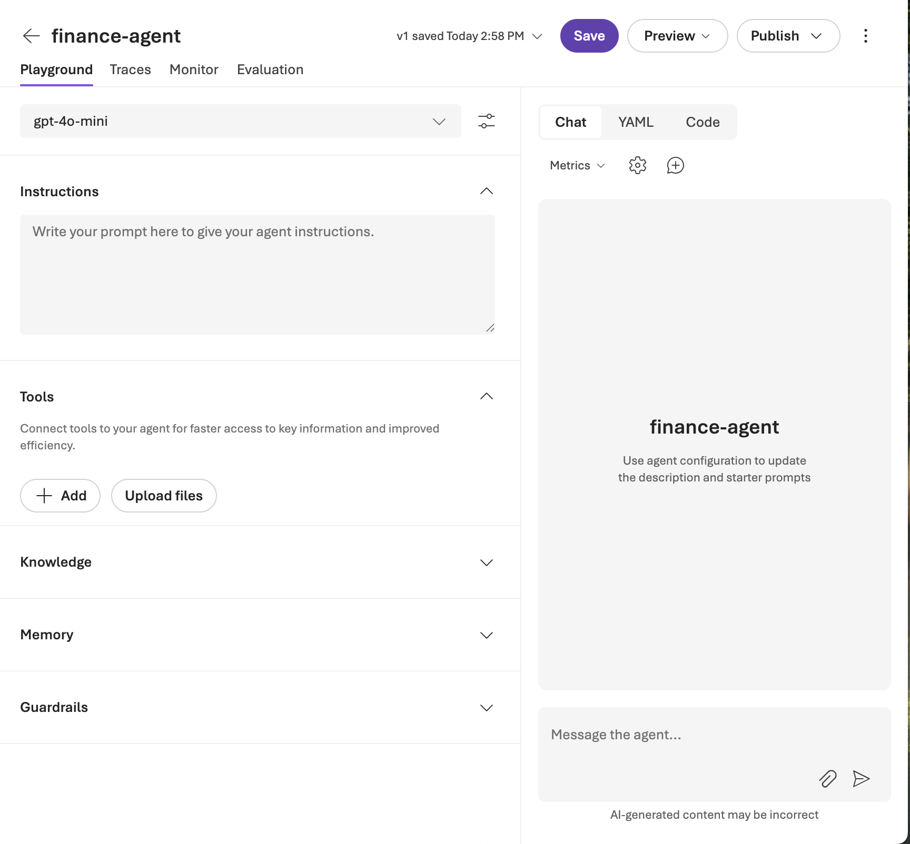

4. Add an MCP tool by clicking on **Tools** --> **Browse all tools**, then in the dialog go to the **Custom** tab and select **Model Context Protocol (MCP)**

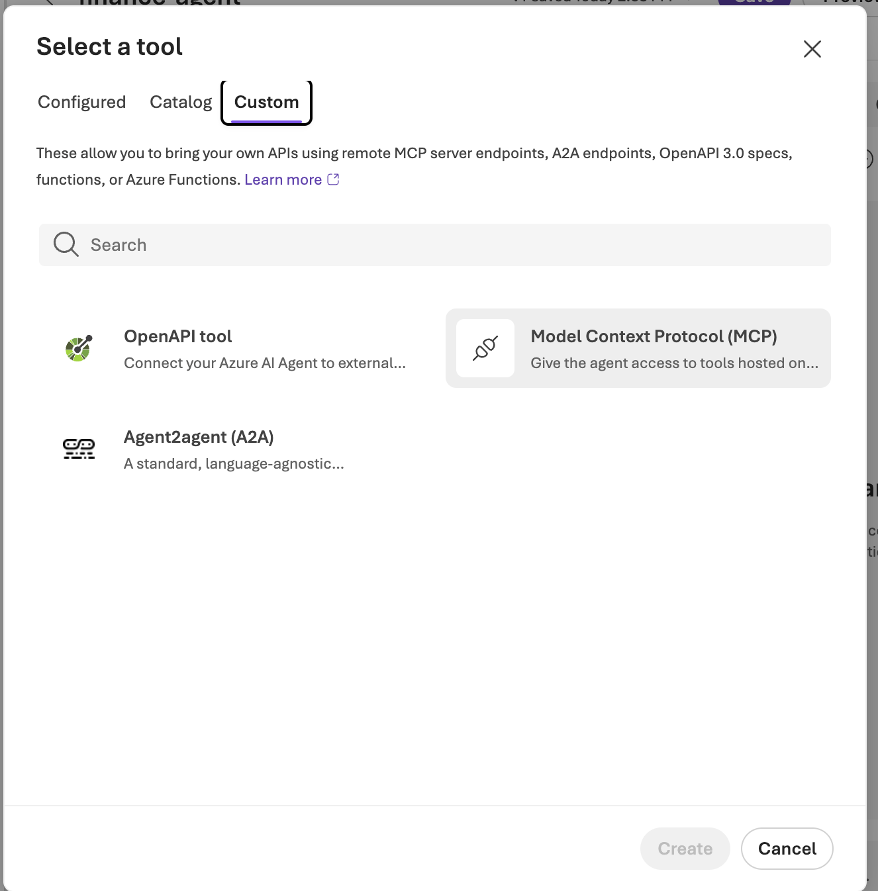

5. In the "Add Model Context Protocol Tool" Dialog enter the mcp server information that your workshop administrator setup for you.  Set the following values:

* **Name**: `mcp-server-finance-agent`
* **Remote MCP Server endpoint**: `https://neo4jmcp-app-dev.{hostname}.eastus.azurecontainerapps.io/mcp`  <---- CRITICAL BE SURE TO ADD /MCP At the end
* **Authentication**: Key based
* **Credential Key**: Authorization
* **Credential Value** - the value needs to be the word Bearer followed by the actual token: Bearer bearer_token....===

6. Click **Save** at the top of the dialog. The agent is now set up. Test it by entering a query like "What risks does the database say that Microsoft face?"

   We need to use "Microsoft" because it does an exact string match for the company name.

You will see the agent ask you for approval to run the MCP request - click yes. Then you will see the MCP call in the context that it runs along with the results. Also try things like "What is the schema?"

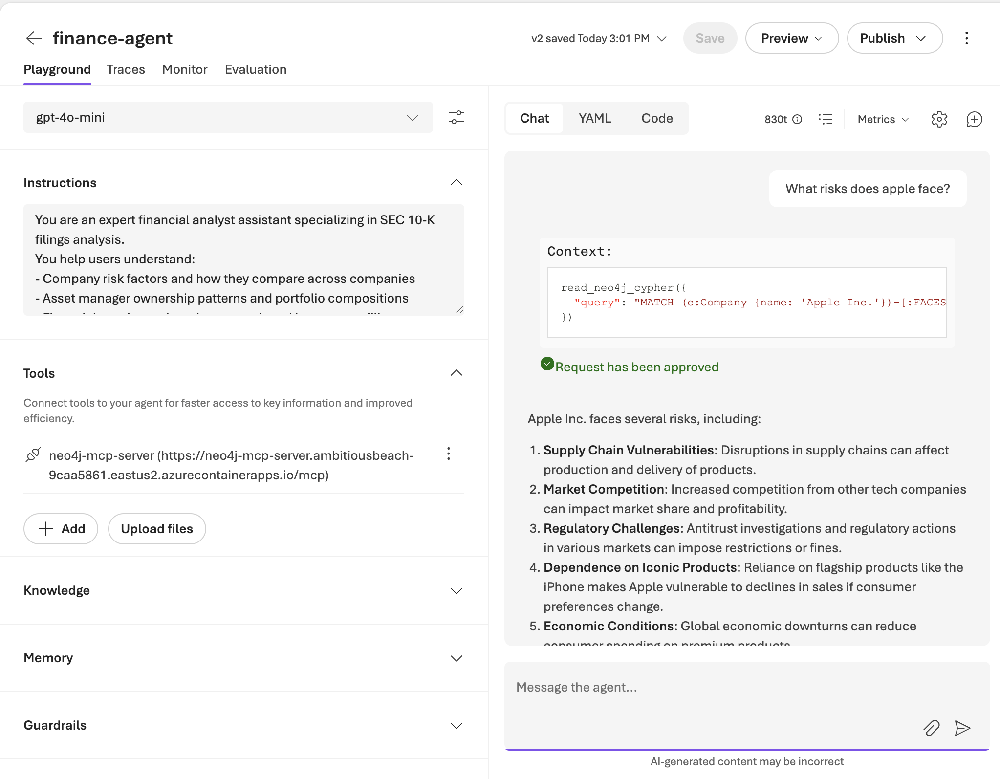

7. Try publishing it and see what your new agent looks like!

---

## Summary

You have now set up Microsoft Foundry with:
- A new Foundry project
- **gpt-4o-mini** or **gpt-4o** deployed for chat completions
- **text-embedding-3-small** deployed for vector embeddings

**This completes Part 1 (No-Code Track) of the workshop.**

## What's Next

To continue with the coding labs in Part 2:

1. Continue to [Lab 4 - Start Codespace](../Lab_4_Start_Codespace) to set up your development environment
2. Then proceed to [Lab 5 - Foundry Agents](../Lab_5_Foundry_Agents) to build your first agent with the Microsoft Agent Framework
