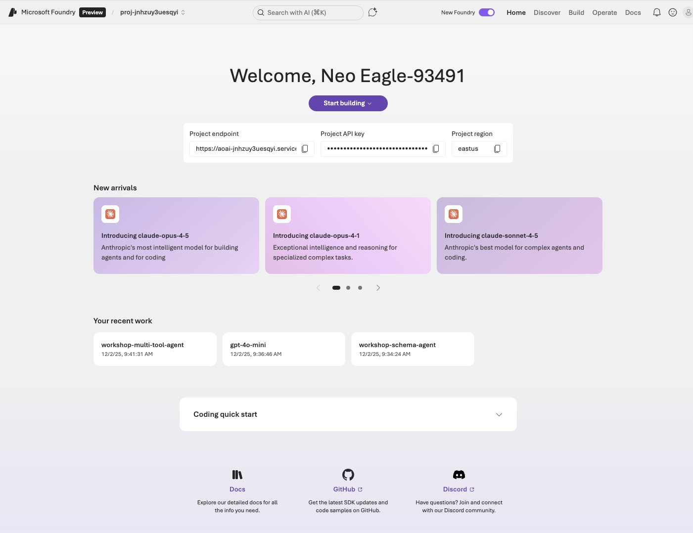
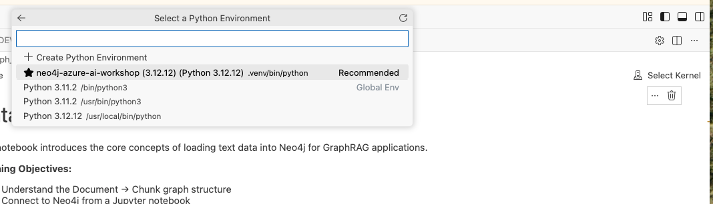

# Lab 4 - Start Codespace

In this lab, you will spin up a GitHub Codespace instance to use as your development environment for the coding labs in Part 2 of the workshop.

## Prerequisites

Before starting, make sure you have:
- Completed **Lab 3** (Microsoft Foundry setup with model deployments)
- Your **Neo4j Aura credentials** (URI, username, password) from Lab 1

## What is a GitHub Codespace?

A GitHub Codespace is a cloud-hosted development environment that runs in your browser. When you launch a Codespace, GitHub provisions a virtual machine with:

- A pre-configured VS Code editor
- All required tools and dependencies already installed (Python, Azure CLI, GitHub CLI)
- Extensions for Azure development, Python, and Jupyter notebooks
- A terminal with access to run commands

This means you don't need to install anything on your local machine—everything is ready to go in the cloud.

## Codespace Configuration

When you launch the codespace below you will need to have the following values from previous workshop steps:

| Variable | Where to Find It |
|----------|-----------------|
| `NEO4J_URI` | From [Lab 1, Step 8](../Lab_1_Aura_Setup/Neo4j_Aura_Signup.md) — the connection URI from the credentials dialog after instance creation |
| `NEO4J_USERNAME` | From [Lab 1, Step 8](../Lab_1_Aura_Setup/Neo4j_Aura_Signup.md) — typically `neo4j` |
| `NEO4J_PASSWORD` | From [Lab 1, Step 8](../Lab_1_Aura_Setup/Neo4j_Aura_Signup.md) — from the credentials dialog (or the downloaded credentials file) |

## Launch the Codespace

Click the button below to start your development environment:

[](https://codespaces.new/neo4j-partners/neo4j-and-azure-lab)


## Setup

Once your Codespace has started, you will see the terminal as it starts up. Eventually it will say:

```
Use Cmd/Ctrl + Shift + P -> View Creation Log to see full logs
✔ Finishing up...
⠼ Running postCreateCommand...
  › bash scripts/start_dev_container_post_create.sh
```

Wait for that to complete before proceeding.

For reference, you can also view the complete setup instructions in [GUIDE_DEV_CONTAINERS.md](../GUIDE_DEV_CONTAINERS.md).

### Step 1: Sign in to Azure

In the Codespace terminal, authenticate with Azure:

```bash
az login --use-device-code
```

### Step 2: Configure CONFIG.txt

Edit the `CONFIG.txt` file in the root of the project and fill in your values:

1. Add your **Neo4j credentials** from Lab 1:
   ```
   NEO4J_URI=neo4j+s://xxxxx.databases.neo4j.io
   NEO4J_USERNAME=neo4j
   NEO4J_PASSWORD=your-password-here
   ```

2. Add your **Azure AI Foundry project endpoint** from Lab 3. To find it, go to https://ai.azure.com/, open your project, and copy the **Project endpoint** value from the project home page:

   

   ```
   AZURE_AI_PROJECT_ENDPOINT=<paste your project endpoint here>
   ```

> **Note:** Set `AZURE_AI_MODEL_NAME` to whichever model you deployed in Lab 3 (`gpt-4o-mini` or `gpt-4o`).

## Running the Notebooks

To run the Jupyter notebooks in the labs, you need to select the correct Python kernel:

1. Click **Select Kernel** in the top right of the notebook, then select **Python Environments...**

   

2. Select the **neo4j-azure-ai-workshop** environment (marked as Recommended)

   

## Alternative: Run GitHub Codespace in VS Code

If you are unable to run the Codespace in your browser (due to network restrictions, browser compatibility issues, or preference), you can open and run the Codespace directly in VS Code on your local machine.

**Quick Steps:**
1. Install [Visual Studio Code](https://code.visualstudio.com/)
2. Install the [GitHub Codespaces extension](https://marketplace.visualstudio.com/items?itemName=GitHub.codespaces): Open VS Code, click the Extensions icon in the sidebar (or press `Ctrl+Shift+X` / `Cmd+Shift+X`), search for "GitHub Codespaces", and click Install
3. Sign in to GitHub from VS Code (click the Accounts icon in the sidebar)
4. Open the Command Palette (`Ctrl+Shift+P` / `Cmd+Shift+P`) and run "Codespaces: Connect to Codespace"
5. Select your running Codespace or create a new one

For detailed instructions, see GitHub's official documentation: [Using GitHub Codespaces in Visual Studio Code](https://docs.github.com/en/codespaces/developing-in-a-codespace/using-github-codespaces-in-visual-studio-code)

## Running Locally (Without a Codespace)

If you prefer to run the workshop on your local machine instead of using a Codespace, follow these steps:

### Prerequisites

Before starting, ensure you have:
- Windows 10/11, macOS, or Linux
- Administrator access on your machine
- An active Azure subscription
- Neo4j Aura credentials from Lab 1

### Step 1: Download the Project

1. Go to https://github.com/neo4j-partners/neo4j-and-azure-lab
2. Click the green "Code" button
3. Select "Download ZIP" (or clone with `git clone`)
4. Extract the ZIP file to a location on your computer

### Step 2: Install Python 3.12

This project requires Python 3.12 (not 3.13 or later).

1. Download Python 3.12 from https://www.python.org/downloads/
   - Select a **3.12.x** version (e.g., 3.12.7)
2. Run the installer:
   - **Windows**: Check "Add Python 3.12 to PATH", then click "Install Now"
   - **macOS/Linux**: Follow the installer prompts
3. Verify installation:
   ```bash
   python --version
   # Should output: Python 3.12.x
   ```

### Step 3: Install uv (Python Package Manager)

uv is a fast Python package installer used by this project.

```bash
pip install uv
uv --version
```

### Step 4: Install Azure CLI

The Azure CLI is required for authenticating with Azure.

- **Windows**: Download from https://aka.ms/installazurecliwindows
- **macOS**: `brew install azure-cli`
- **Linux**: See https://docs.microsoft.com/en-us/cli/azure/install-azure-cli-linux

After installation, sign in:
```bash
az login
```

### Step 5: Install Visual Studio Code

1. Download VS Code from https://code.visualstudio.com/
2. Install the **Python** and **Jupyter** extensions from the Extensions marketplace

### Step 6: Set Up the Project

1. Open the project folder in VS Code
2. Open a terminal and create the Python environment:
   ```bash
   uv sync
   ```
3. Select the Python interpreter:
   - Press `Ctrl+Shift+P` (or `Cmd+Shift+P` on macOS)
   - Type "Python: Select Interpreter"
   - Choose the interpreter from the `.venv` folder

### Step 7: Configure Environment Variables

1. Edit `CONFIG.txt` and add your Neo4j credentials and Azure Foundry endpoint (from Lab 3):
   ```
   NEO4J_URI=neo4j+s://xxxxx.databases.neo4j.io
   NEO4J_USERNAME=neo4j
   NEO4J_PASSWORD=your-password-here

   AZURE_AI_PROJECT_ENDPOINT=https://<resource-name>.services.ai.azure.com/api/projects/<project-name>
   AZURE_AI_MODEL_NAME=gpt-4o-mini
   AZURE_AI_EMBEDDING_NAME=text-embedding-3-small
   ```

   > **Note:** To find your project endpoint, go to https://ai.azure.com/, open your project from Lab 3, and copy the **Project endpoint** from the project home page.

### Step 8: Run the Notebooks

1. Navigate to a lab folder (e.g., `Lab_6_Context_Providers`)
2. Open a notebook file (e.g., `01_data_loading.ipynb`)
3. Select the **neo4j-azure-ai-workshop** kernel when prompted
4. Run the notebook cells using `Shift+Enter`

### Troubleshooting

| Problem | Solution |
|---------|----------|
| Python version is not 3.12 | Ensure Python 3.12.x is installed and in your PATH |
| `uv` command not found | Close and reopen your terminal |
| Azure CLI authentication fails | Run `az logout` then `az login` again |
| Jupyter kernel not found | Run `uv sync` again and restart VS Code |
| Import errors in notebooks | Ensure you've selected the correct Python interpreter from `.venv` |

## Cleaning Up Codespaces

If you need to start fresh or are running out of resources, you can delete any running Codespaces at [github.com/codespaces](https://github.com/codespaces).

## Next Steps

After completing this lab, continue to [Lab 5 - Foundry Agents](../Lab_5_Foundry_Agents) to build your first agent with the Microsoft Agent Framework.
