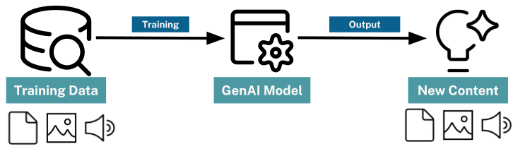
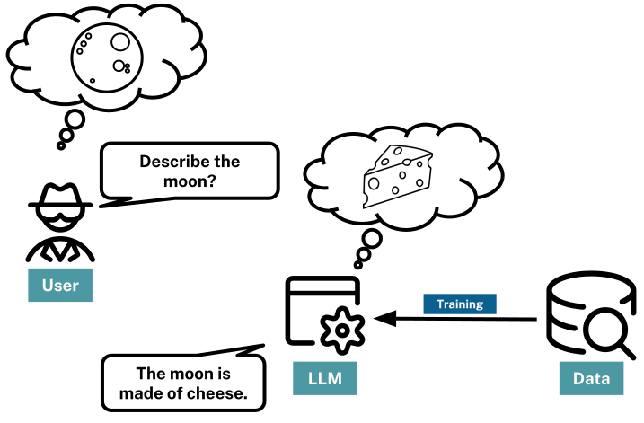

# The GenAI Promise and Its Limits

## Introduction

Generative AI (GenAI) has transformed how we interact with information. Large Language Models (LLMs) like GPT can answer questions, summarize documents, generate code, and engage in natural conversation. But these capabilities come with fundamental limitations that shape how we build AI-powered applications.

In this lesson, you'll understand what LLMs can and cannot do—and why these limitations matter for building production systems.

## What Generative AI Does Well

LLMs excel at tasks that rely on pattern recognition and language fluency:

- **Text generation**: Creating human-like responses, summaries, and explanations
- **Language understanding**: Parsing intent, extracting meaning, following instructions
- **Pattern completion**: Continuing sequences, filling in blanks, generating variations
- **Translation and transformation**: Converting between formats, styles, and languages

These capabilities emerge from training on vast amounts of text data. The model learns statistical patterns—which words follow which, how ideas connect, what makes coherent prose.

## The Three Core Limitations

Despite their impressive capabilities, LLMs have fundamental limitations that affect every application:

### 1. Hallucination: Confident But Wrong

LLMs generate responses based on statistical likelihood, not factual verification. They produce the most *probable* continuation, which isn't always the most *accurate* one.

When an LLM encounters a question it can't answer from training data, it doesn't say "I don't know." Instead, it generates plausible-sounding text that may be completely false—with full confidence.

**Example**: Ask an LLM about a recent event or obscure fact, and it may confidently provide incorrect information, complete with fabricated details and citations.

This phenomenon—called **hallucination**—makes LLMs unreliable for factual questions without additional safeguards.

### 2. Knowledge Cutoff: No Access to Your Data

LLMs are trained at a specific point in time on publicly available data. They don't know:

- **Recent events**: Anything after their training cutoff
- **Private information**: Your company's documents, databases, or internal knowledge
- **Real-time data**: Current prices, live statistics, changing conditions

If you ask about your company's Q3 results or last week's board meeting, the LLM has no information to work with—but may still generate a confident (and wrong) response.

### 3. Relationship Blindness: Can't Connect the Dots

LLMs process text sequentially. They can find relevant passages, but they struggle with questions that require understanding relationships across multiple sources:

- "Which asset managers own companies that face cybersecurity risks?"
- "What products are mentioned by companies that share common risk factors?"
- "How are these two companies connected through their executives?"

These questions require *reasoning over relationships*—connecting entities across documents, understanding how things relate, and traversing chains of connections. Traditional LLMs treat each piece of text in isolation.

## Why These Limitations Matter

These aren't minor inconveniences—they fundamentally shape what you can build:

| Limitation | Impact | Example |
|------------|--------|---------|
| Hallucination | Can't trust answers without verification | Legal brief with fabricated case citations |
| Knowledge cutoff | Can't answer questions about your data | "What did our CEO say last quarter?" |
| Relationship blindness | Can't reason across connected information | "Which investors are exposed to these risks?" |

Building production AI systems means addressing these limitations directly.

## The Solution: Providing Context

The good news: all three limitations have a common solution—**providing context**.

When you give an LLM relevant information in its prompt:
- It has facts to work with (reduces hallucination)
- It can access your specific data (overcomes knowledge cutoff)
- You can structure that information to show relationships (enables reasoning)

This is the foundation of Retrieval-Augmented Generation (RAG): retrieve relevant context, then let the LLM generate grounded responses.

But not all context is equal. In the next lesson, you'll learn why traditional RAG approaches have their own limitations—and why we need knowledge graphs.

## Check Your Understanding

### What is hallucination in the context of LLMs?

**Options:**
- [ ] When the model generates creative fiction
- [x] When the model confidently produces incorrect information
- [ ] When the model refuses to answer a question
- [ ] When the model repeats the same response

Hint

Think about what happens when an LLM doesn't have the information it needs but still tries to be helpful.

Show Answer

**When the model confidently produces incorrect information**. Hallucination occurs because LLMs generate statistically probable responses rather than factually verified ones. When they lack the necessary information, they don't admit uncertainty—they generate plausible-sounding but false content.

## Summary

In this lesson, you learned about the fundamental limitations of LLMs:

- **Hallucination**: LLMs generate probable responses, not verified facts
- **Knowledge cutoff**: LLMs can't access recent events or your private data
- **Relationship blindness**: LLMs struggle with questions requiring cross-document reasoning

These limitations aren't bugs to be fixed—they're fundamental to how LLMs work. The solution is providing context, which leads us to RAG (Retrieval-Augmented Generation).

In the next lesson, you'll learn how traditional RAG works and why it has its own limitations that knowledge graphs can solve.

---

**Navigation:**
- [← Previous: Lab 3 Overview](README.md)
- [↑ Back to Lab 5](README.md)
- [Next: Context and Traditional RAG →](02-context-and-rag.md)
