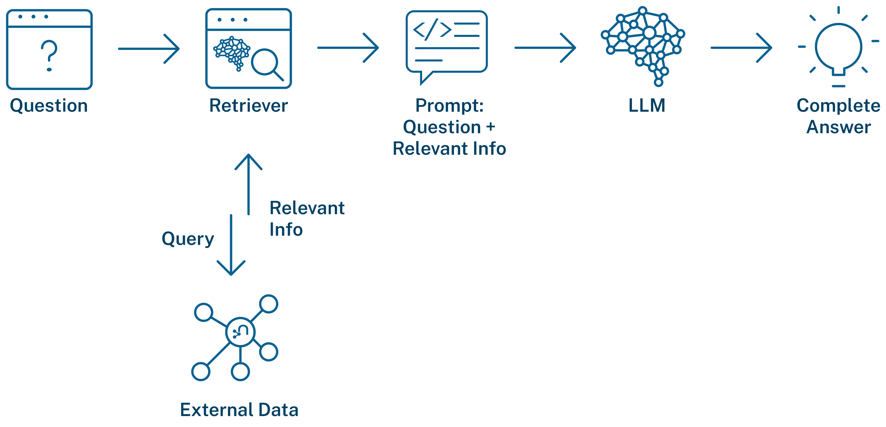

# Retrievers and the GraphRAG Pattern

## Introduction

You've built a knowledge graph with structured entities, relationships, and vector-enabled chunks. Now you need to retrieve relevant context from it to answer questions.

This is where **retrievers** come in—components that find and return relevant information from your knowledge graph to provide context for LLM-generated answers.

## What is a Retriever?


A retriever searches your knowledge graph and returns relevant information. The `neo4j-graphrag` package provides three retriever types, each designed for different question patterns:

| Retriever | What It Does | Best For |
|-----------|--------------|----------|
| **Vector Retriever** | Semantic similarity search | Finding content about topics and concepts |
| **Vector Cypher Retriever** | Semantic search + graph traversal | Content + related entities and relationships |
| **Text2Cypher Retriever** | Natural language to database queries | Specific facts, counts, lists |

## The GraphRAG Class

Retrievers work with the `GraphRAG` class, which combines retrieval with LLM generation:

```
User Question
    ↓
Retriever finds relevant context
    ↓
Context passed to LLM
    ↓
LLM generates grounded answer
```

The retriever's job is finding the right context. The LLM's job is generating a coherent answer from that context.

## How to Think About Retriever Selection

When choosing a retriever, ask yourself:

**Is this a content question or a fact question?**
- Content questions ("What is Apple's strategy?") → Vector or Vector Cypher
- Fact questions ("How many risk factors?") → Text2Cypher

**Do I need related entities from the graph?**
- Just text content → Vector
- Text + connected entities → Vector Cypher

**Am I asking about specific relationships?**
- Ownership, connections, shared attributes → Text2Cypher or Vector Cypher

## Preview: The Three Retrievers

### Vector Retriever

Finds content by *meaning*, not keywords.

Your question becomes an embedding. The retriever finds chunks with similar embeddings. Even if your question uses different words than the documents, semantic search finds relevant content.

**Example**: "What challenges does Apple face?" finds chunks about "risks," "threats," and "obstacles"—even without those exact words.

### Vector Cypher Retriever

Starts with semantic search, then traverses the graph.

First finds relevant chunks (like Vector Retriever), then executes a Cypher query to gather connected entities and relationships.

**Example**: "Which asset managers are affected by banking regulations?" finds chunks about banking regulations, then traverses to companies mentioned → asset managers who own those companies.

### Text2Cypher Retriever

Converts your question directly to a database query.

An LLM generates Cypher from your natural language question and the graph schema. Returns structured, precise results.

**Example**: "How many companies are in the database?" generates `MATCH (c:Company) RETURN count(c)` and returns the exact count.

## The Decision Framework

| Question Pattern | Best Retriever | Why |
|-----------------|----------------|-----|
| "What is..." / "Tell me about..." | Vector | Semantic content search |
| "Which [entities] are affected by [topic]..." | Vector Cypher | Content + relationships |
| "How many..." / "List all..." / "Who owns..." | Text2Cypher | Precise database query |

Understanding *why* each retriever works for different questions is essential—both for building effective systems and for designing agents that choose automatically (Lab 6).

## Querying the Knowledge Graph



With retrievers, you can query your knowledge graph to extract relevant information based on the type of question being asked.

## Summary

In this lesson, you learned:

- **Retrievers** find relevant context from your knowledge graph
- **Three types**: Vector (semantic), Vector Cypher (semantic + graph), Text2Cypher (precise queries)
- **GraphRAG** combines retrieval with LLM generation
- **Selection** depends on whether you need content, relationships, or facts

In the following lessons, you'll learn each retriever in depth—when to use it, how it works, and what questions it handles best.

---

**Navigation:**
- [← Previous: Vectors and Semantic Search](../lab-5-knowledge-graph/07-vectors.md)
- [↑ Back to Lab 6](README.md)
- [Next: Vector Retriever →](02-vector-retriever.md)
