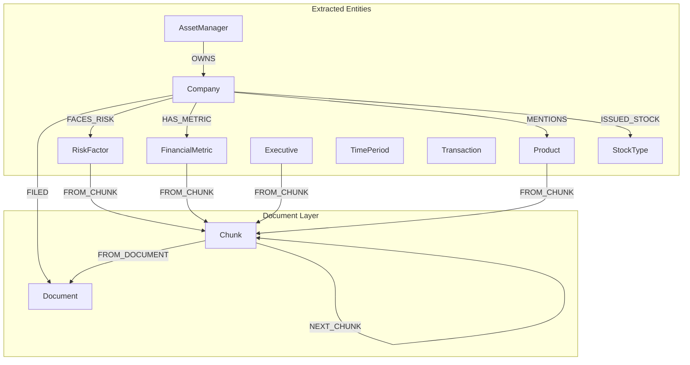

# Data Model

This document describes the knowledge graph data model used in this workshop.

## Graph Schema

The knowledge graph is built from SEC 10-K filings and contains the following structure:



## Node Types

| Node Label | Description | Key Properties |
|------------|-------------|----------------|
| **Document** | SEC 10-K filing document | `path`, `name` |
| **Chunk** | Text segment from a document | `text`, `index`, `embedding` |
| **Company** | Company or organization | `name` |
| **Product** | Product mentioned in filings | `name` |
| **RiskFactor** | Risk factor disclosed by company | `name` |
| **FinancialMetric** | Financial metric or KPI | `name` |
| **Executive** | Company executive | `name` |
| **AssetManager** | Investment manager/fund | `managerName` |
| **TimePeriod** | Time period reference | `name` |
| **Transaction** | Financial transaction | `name` |
| **StockType** | Type of stock issued | `name` |

## Relationship Types

| Relationship | From | To | Description |
|--------------|------|-----|-------------|
| `FROM_DOCUMENT` | Chunk | Document | Links chunk to source document |
| `NEXT_CHUNK` | Chunk | Chunk | Sequential chunk ordering |
| `FROM_CHUNK` | Entity | Chunk | Entity extracted from this chunk |
| `FILED` | Company | Document | Company filed this document |
| `FACES_RISK` | Company | RiskFactor | Company faces this risk |
| `HAS_METRIC` | Company | FinancialMetric | Company reports this metric |
| `MENTIONS` | Company | Product | Company mentions this product |
| `OWNS` | AssetManager | Company | Manager owns shares in company |
| `ISSUED_STOCK` | Company | StockType | Company issued this stock type |

## Indexes

The database includes the following indexes for efficient querying:

- **Vector Index** (`chunkEmbeddings`): On `Chunk.embedding` for semantic search
- **Fulltext Index** (`search_entities`): On `Company.name`, `Product.name`, `RiskFactor.name` for text search
- **Fulltext Index** (`search_chunks`): On `Chunk.text` for keyword search

## Example Queries

### Find all risks for a company
```cypher
MATCH (c:Company)-[:FACES_RISK]->(r:RiskFactor)
WHERE c.name CONTAINS "APPLE"
RETURN r.name LIMIT 10
```

### Get chunks from a document
```cypher
MATCH (c:Chunk)-[:FROM_DOCUMENT]->(d:Document)
WHERE d.path CONTAINS "apple"
RETURN c.text, c.index
ORDER BY c.index
```

### Find which asset managers own a company
```cypher
MATCH (am:AssetManager)-[:OWNS]->(c:Company)
WHERE c.name CONTAINS "NVIDIA"
RETURN am.managerName, c.name
```
