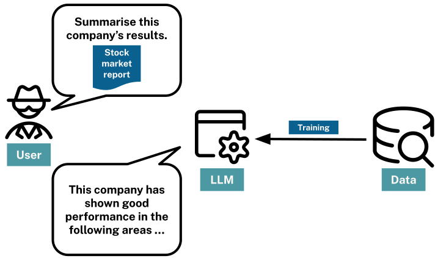

# Context and the Limits of Traditional RAG

## The Power of Context

Providing context in prompts dramatically improves LLM responses. When you include relevant information, data, or details, the model can:

- Generate accurate summaries grounded in actual documents
- Answer questions about your specific data
- Reduce hallucination by having facts to reference

This insight leads to Retrieval-Augmented Generation (RAG): instead of relying solely on training data, retrieve relevant context at query time and provide it to the LLM.



## How Traditional RAG Works

Traditional RAG follows a simple pattern:

1. **Index documents**: Break documents into chunks and create embeddings (vector representations)
2. **Receive query**: User asks a question
3. **Retrieve context**: Find chunks with embeddings similar to the query
4. **Generate response**: Pass retrieved chunks to LLM as context

This approach works well for many use cases. But it has fundamental limitations.

## The Problem with Traditional RAG

Traditional RAG treats documents as isolated, unstructured blobs. Each chunk is independent—there's no understanding of how information connects.

**What traditional RAG sees:**
```
Chunk 1: "Apple Inc. faces cybersecurity risks including..."
Chunk 2: "BlackRock Inc. holds shares in technology companies..."
Chunk 3: "The semiconductor supply chain impacts..."
```

**What traditional RAG misses:**
- Which specific companies does BlackRock own?
- Do any of those companies face cybersecurity risks?
- How are supply chain issues connected to specific products?

Traditional RAG retrieves *similar content*, not *connected information*. It can find text about cybersecurity and text about BlackRock, but it can't tell you which asset managers are exposed to cybersecurity risks through their holdings.

## Questions Traditional RAG Can't Answer

Some questions require understanding relationships across documents:

| Question | Why Traditional RAG Struggles |
|----------|------------------------------|
| "Which asset managers own companies facing cyber risks?" | Requires connecting ownership data to risk mentions |
| "What products are mentioned by companies that share risk factors?" | Requires finding shared entities across documents |
| "How many companies mention supply chain issues?" | Requires aggregation, not similarity search |
| "What executives work for companies in the tech sector?" | Requires traversing entity relationships |

These questions need more than similarity search—they need *structured context* that preserves relationships.

## From Unstructured to Structured

The core insight: Information isn't truly unstructured. Documents contain *entities* (companies, people, products, risks) and *relationships* (owns, faces, mentions, works for).

Traditional RAG ignores this structure. It treats a document as a bag of words to embed and search.

GraphRAG extracts this structure, creating a *knowledge graph* that preserves:
- **Entities**: The things mentioned in documents
- **Relationships**: How those things connect
- **Properties**: Attributes and details about entities

This structured representation enables questions that traverse relationships, aggregate across entities, and reason about connections.


## The GraphRAG Solution

GraphRAG transforms the retrieval problem:

**Traditional RAG asks**: "What chunks are similar to this query?"

**GraphRAG asks**: "What entities and relationships are relevant to this query?"

This enables three retrieval patterns:
- **Vector search**: Find semantically similar content (what traditional RAG does)
- **Graph traversal**: Follow relationships from relevant content to connected entities
- **Database queries**: Answer precise questions about entities and relationships

In the next lesson, you'll learn how to transform documents into knowledge graphs that enable this structured retrieval.

## Check Your Understanding

### Why can't traditional RAG answer "Which asset managers own companies facing cyber risks?"

**Options:**
- [ ] The question is too complex for any AI system
- [ ] Traditional RAG doesn't support vector search
- [x] Traditional RAG treats chunks as isolated blobs without relationship information
- [ ] The documents don't contain this information

<details>
<summary>Hint</summary>
Think about what information you'd need to answer this question and whether similarity search alone can provide it.
</details>

<details>
<summary>Show Answer</summary>
**Traditional RAG treats chunks as isolated blobs without relationship information**. To answer this question, you need to: (1) find companies that face cyber risks, (2) find asset managers, and (3) know which asset managers own which companies. Traditional RAG can find similar text, but it doesn't preserve the OWNS relationship between asset managers and companies.
</details>

## Summary

In this lesson, you learned:

- **Context improves LLM responses** by providing relevant information in prompts
- **Traditional RAG** retrieves similar chunks based on vector similarity
- **The limitation**: Traditional RAG treats documents as isolated blobs, missing relationships
- **Questions requiring relationships** can't be answered with similarity search alone
- **GraphRAG** extracts structure from documents, preserving entities and relationships

In the next lesson, you'll learn how to transform documents into knowledge graphs using the `neo4j-graphrag` Python package.

---

**Navigation:**
- [← Previous: GenAI Promise and Limits](01-genai-and-limitations.md)
- [↑ Back to Lab 3](README.md)
- [Next: From Documents to Knowledge Graphs →](03-building-knowledge-graphs.md)
