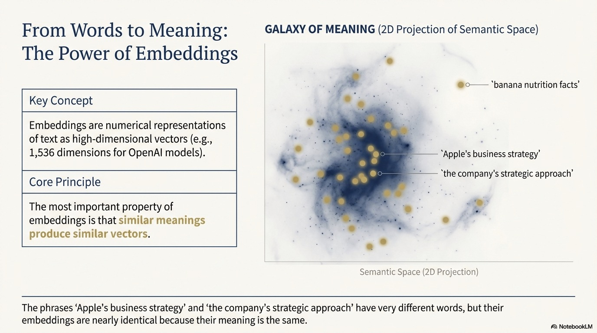
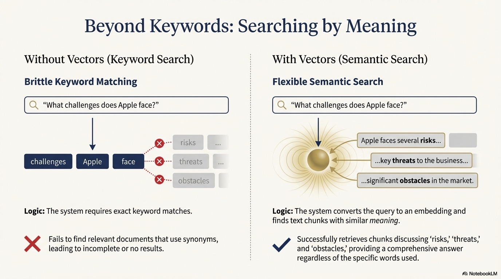

<style>
section {
  --marp-auto-scaling-code: false;
}

li {
  opacity: 1 !important;
  animation: none !important;
  visibility: visible !important;
}

/* Disable all fragment animations */
.marp-fragment {
  opacity: 1 !important;
  visibility: visible !important;
}

ul > li,
ol > li {
  opacity: 1 !important;
}
</style>


# Traditional RAG: Chunking and Vector Search

---

## Why RAG Was Adopted

Remember the LLM limitations we discussed:
- **Hallucination** - Generates confident but wrong information
- **Knowledge cutoff** - No access to your private data
- **Relationship blindness** - Can't connect information

**The insight:** If we could provide LLMs with relevant context, we could address these limitations.

This led to **Retrieval-Augmented Generation (RAG)**.

---

## The Power of Context

Providing context in prompts dramatically improves LLM responses.

**When you include relevant information, the model can:**
- Generate accurate summaries grounded in actual documents
- Answer questions about your specific data
- Reduce hallucination by having facts to reference

**RAG automates this:** Instead of manually adding context, retrieve it automatically based on the user's question.

---

## How Traditional RAG Works

Traditional RAG follows a simple pattern:

1. **Index documents**: Break documents into chunks and create embeddings
2. **Receive query**: User asks a question
3. **Retrieve context**: Find chunks with embeddings similar to the query
4. **Generate response**: Pass retrieved chunks to LLM as context

Let's understand each component: chunking, embeddings, and vector search.

---

## Why Chunking Matters

LLMs have **context window limits**—they can only process so much text at once.

**The problem:**
- Documents can be thousands of pages
- You can't send everything to the LLM
- You need to find the *relevant* parts

**The solution:** Break documents into smaller **chunks** that can be:
- Indexed for search
- Retrieved when relevant
- Fit within the LLM's context window

---

## Common Chunking Strategies

| Strategy | How It Works | Best For |
|----------|--------------|----------|
| **Fixed-size** | Split every N characters/tokens | Simple, predictable |
| **Sentence** | Split on sentence boundaries | Preserving complete thoughts |
| **Paragraph** | Split on paragraph breaks | Structured documents |
| **Semantic** | Split when topic changes | Long-form content |
| **Recursive** | Try multiple strategies in order | General purpose |

**Overlap** between chunks helps preserve context at boundaries.

---




---

## What is a Vector?

Vectors are lists of numbers.

The vector `[1, 2, 3]` represents a point in three-dimensional space.

In machine learning, vectors can represent much more complex data—including the *meaning* of text.

---

## The Smart Librarian Analogy

Think of embeddings like having a **really smart librarian** who has read every book in the library.

**Traditional catalog (keywords):**
- Books organized by title, author, subject
- Search for "dogs" only finds books with "dogs" in the title/subject
- Miss books about "canines," "puppies," or "pets"

**Smart librarian (embeddings):**
- Understands what each book is *about*
- "I want something about loyal companions" → finds dog books, even without the word "dog"
- Organizes by meaning, not just labels

---



---

## Similarity Search

Vector similarity is typically measured by **cosine similarity**—the angle between two vectors:

| Score | Meaning |
|-------|---------|
| Near 1.0 | Very similar meanings |
| Near 0.5 | Somewhat related |
| Near 0.0 | Unrelated |

When you search, your question becomes an embedding, and the system finds chunks with embeddings close to your question.

---

## The RAG Retrieval Flow

```
User Question
     ↓
Create embedding of question
     ↓
Compare to all chunk embeddings
     ↓
Return top K most similar chunks
     ↓
Send chunks + question to LLM
     ↓
LLM generates answer using chunks as context
```

---

## Traditional RAG: What It Enables

**Works well for:**
- "What does this document say about X?"
- Finding relevant passages by topic
- Answering questions within a single document

**The foundation of modern AI assistants**, but as we'll see, it has important limitations when dealing with connected information.

---

## Summary

In this lesson, you learned:

- **Chunking** breaks documents into searchable pieces
- **Embeddings** encode text meaning as vectors
- **Similar meanings** produce similar vectors
- **Semantic search** finds relevant content by meaning, not keywords
- **Traditional RAG** combines these to provide context to LLMs

**Next:** Understanding the limits of traditional RAG and how GraphRAG addresses them.

