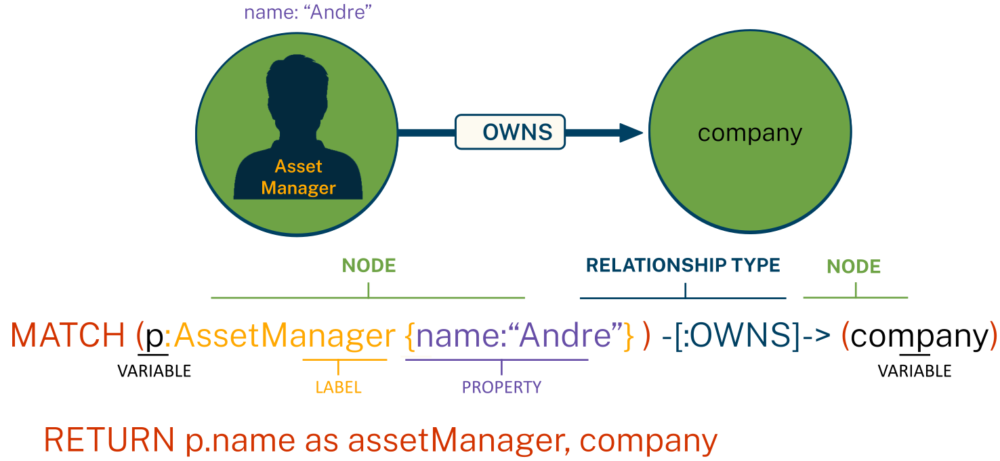

# What is Generative AI

---

## Recap

In this lesson, you will recap some key concepts:

* What is Generative AI
* Knowledge Graphs
* Cypher

---

## Introduction

Generative AI (or GenAI) refers to artificial intelligence systems designed to create new content that resembles human-made data. The data could be text, images, audio, or code.

These models, like GPT (for text) or DALL-E (for images), are trained on large datasets and use patterns learned from this data to generate new output.

Generative AI is widely used in applications such as chatbots, content creation, image synthesis, and code generation.

Generative AI models are not "intelligent" in the way humans are:
- They do not understand or comprehend the content they generate
- They rely on statistical patterns and correlations learned from their training data

While Generative AI models can produce coherent and contextually relevant outputs, they lack understanding.

---

## Large Language Models (LLMs)

Large Language Models (LLMs) are a type of generative AI model designed to understand and generate human-like text.

These models are trained on vast amounts of text data and can perform various tasks, including answering questions, summarizing data, and analyzing text.

---

## LLM Responses

The response generated by an LLM is a probabilistic continuation of the instructions it receives.

The LLM provides the most likely response based on the patterns it has learned from its training data.

If presented with the instruction:

    "Continue this sequence - A B C"

An LLM could respond:

    "D E F"

---

## Knowledge Graphs

_Knowledge Graph = design patterns to organize & access interrelated data_

Property Graph Model:

* **Nodes** represent entities in the graph
* **Relationships** represent associations or interactions between nodes
* **Properties** represent attributes of nodes or relationships

---

## Cypher

Cypher is a _A Powerful & Expressive Query Language_

---

## Retrieval Augmented Generation (RAG)

RAG combines the power of LLMs with external data retrieval to provide more accurate and contextual responses.

Traditional RAG systems retrieve relevant documents based on similarity search, then provide that context to an LLM to generate responses. However, traditional RAG has limitations - it treats all information as flat, unstructured chunks without understanding relationships between entities.

This is where Knowledge Graphs and GraphRAG come in - providing structured, relationship-aware retrieval that understands context and connections between data points.

---

## Summary

In this lesson, you recapped key concepts about Generative AI, Knowledge Graphs, and Cypher:

* **Generative AI** creates new content using patterns learned from training data, but lacks true understanding
* **Large Language Models (LLMs)** generate probabilistic responses based on statistical patterns
* **Knowledge Graphs** organize interrelated data using nodes, relationships, and properties
* **Cypher** provides a powerful query language for working with graph data

In the next lesson, you will learn how to transform unstructured PDF documents into structured knowledge graphs that solve traditional RAG limitations.
