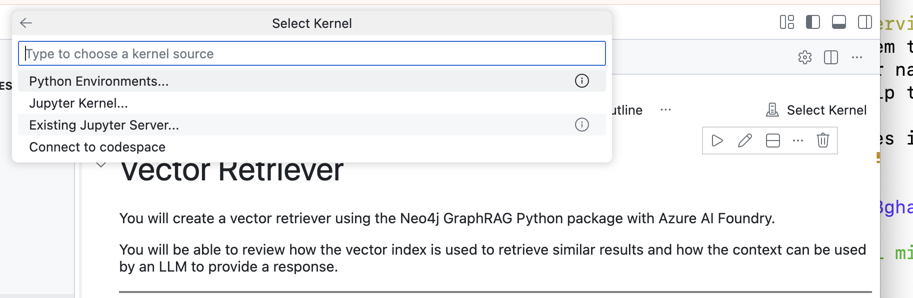
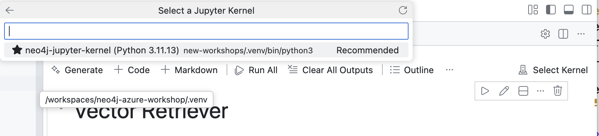

# Agent Framework Workshops with Neo4j GraphRAG

These workshops demonstrate how to build AI agents using the Microsoft Agent Framework with Microsoft Foundry, integrated with Neo4j graph database capabilities via the neo4j-graphrag-python library.

## Prerequisites

Before running setup, ensure you have a `.env` file in the **project root** with the following variables:
If using Azure deployment, you can generate this file with `uv run setup_env.py` from the project root.

## Quick Start

Dependencies are managed by the root `pyproject.toml`. From the **project root**, run:

```bash
# Install dependencies (if not already done)
uv sync --prerelease=allow

# Register the Jupyter kernel
uv run python -m ipykernel install --user --name neo4j-workshop --display-name "Neo4j Workshop"

# Test connections
uv run python new-workshops/solutions/test_connection.py
```

> **Important (Codespaces/Dev Containers):** After registering the kernel, you must **refresh your browser** (or run "Developer: Reload Window" from the command palette) for VS Code to detect the new Jupyter kernel.

## Jupyter Notebooks

Interactive notebooks are available in the `notebooks/` directory for hands-on learning:

### Retriever Workshops (01_xx)

These notebooks demonstrate GraphRAG patterns using neo4j-graphrag with Microsoft Foundry:

- **01_01_vector_retriever.ipynb** - Basic vector search and GraphRAG pipeline
- **01_02_vector_cypher_retriever.ipynb** - Vector search with custom Cypher for richer context
- **01_03_text2cypher_retriever.ipynb** - Natural language to Cypher query generation

### Agent Workshops (02_xx)

These notebooks demonstrate the Microsoft Agent Framework with Microsoft Foundry:

- **02_01_simple_agent.ipynb** - Basic agent with schema retrieval tool
- **02_02_vector_graph_agent.ipynb** - Agent with vector search and graph traversal
- **02_03_text2cypher_agent.ipynb** - Multi-tool agent with schema, vector, and Text2Cypher tools

To run notebooks from the project root:
```bash
uv run jupyter notebook new-workshops/notebooks/
```

### Selecting the Jupyter Kernel (VS Code)

When opening a notebook in VS Code, you need to select the correct Jupyter kernel:

1. Click **Select Kernel** in the top-right corner of the notebook



2. Choose **Jupyter Kernel...** from the dropdown

3. Select **Neo4j Workshop** from the list



## Python Solutions

Complete Python scripts are available in the `solutions/` directory:

### 01_01: Vector Retriever

Basic vector retriever using semantic search over Neo4j.

```bash
uv run python solutions/01_01_vector_retriever.py
```

### 01_02: Vector Cypher Retriever

Enhanced retriever with custom Cypher queries for graph traversal.

```bash
uv run python solutions/01_02_vector_cypher_retriever.py
```

### 01_03: Text2Cypher Retriever

Natural language to Cypher query generation.

```bash
uv run python solutions/01_03_text2cypher_retriever.py
```

### 02_01: Simple Agent

A basic agent with a single tool to retrieve the graph database schema.

```bash
uv run python solutions/02_01_simple_agent.py
```

### 02_02: Vector + Graph Agent

An agent with vector search that retrieves documents and traverses the graph for context.

```bash
uv run python solutions/02_02_vector_graph_agent.py
```

### 02_03: Multi-Tool Agent with Text2Cypher

An agent with three tools: schema retrieval, vector search, and natural language to Cypher queries.

```bash
uv run python solutions/02_03_text2cypher_agent.py
```

## Architecture

These workshops use:

- **Microsoft Agent Framework** - For agent creation and tool management
- **Microsoft Foundry** - For model hosting (via AzureAIAgentClient)
- **neo4j-graphrag-python** - For graph retrieval capabilities
- **Neo4j** - For graph database storage and vector search

## File Structure

```
new-workshops/
├── README.md               # This file
├── notebooks/              # Jupyter notebooks for interactive learning
│   ├── 01_01_vector_retriever.ipynb
│   ├── 01_02_vector_cypher_retriever.ipynb
│   ├── 01_03_text2cypher_retriever.ipynb
│   ├── 02_01_simple_agent.ipynb
│   ├── 02_02_vector_graph_agent.ipynb
│   └── 02_03_text2cypher_agent.ipynb
└── solutions/
    ├── __init__.py
    ├── config.py                    # Shared configuration utilities
    ├── 01_01_vector_retriever.py    # Vector retriever solution
    ├── 01_02_vector_cypher_retriever.py  # Vector Cypher retriever solution
    ├── 01_03_text2cypher_retriever.py    # Text2Cypher retriever solution
    ├── 02_01_simple_agent.py        # Basic agent with schema tool
    ├── 02_02_vector_graph_agent.py  # Agent with vector search
    └── 02_03_text2cypher_agent.py   # Multi-tool agent with text2cypher
```
